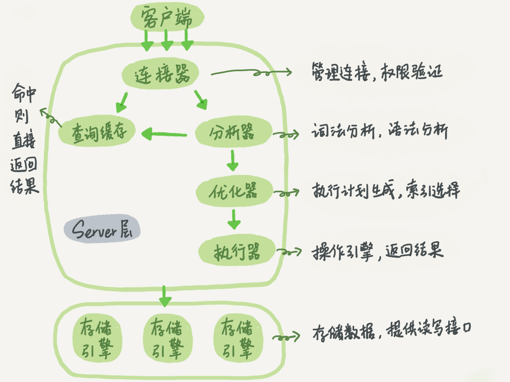
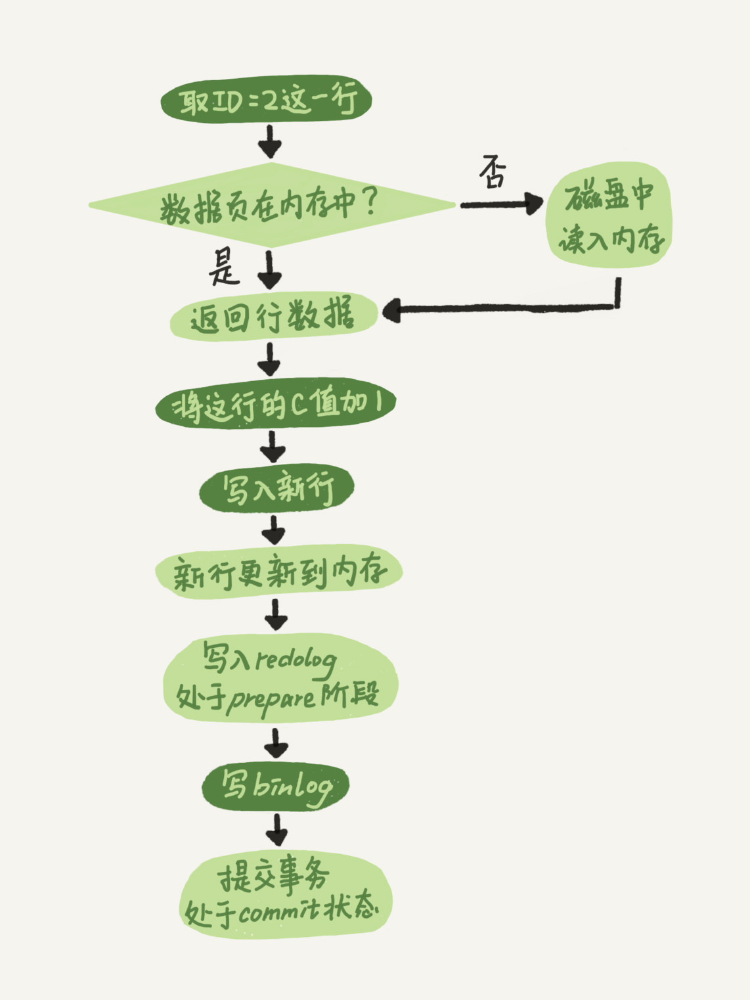
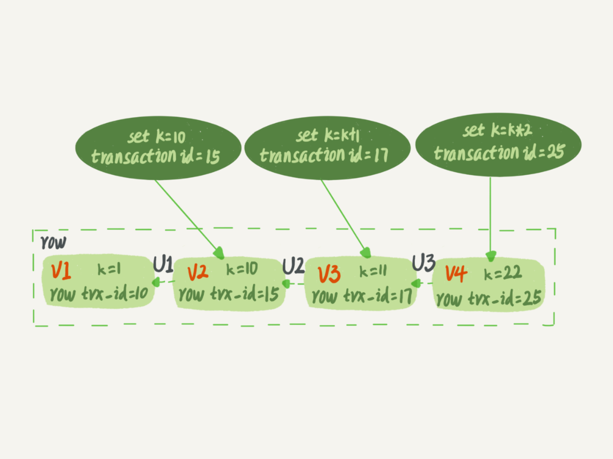
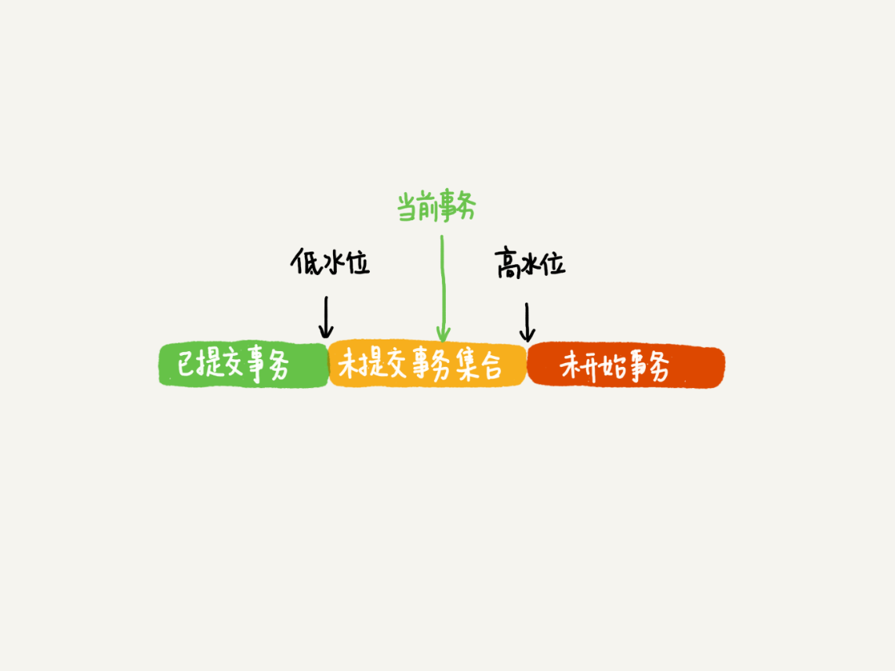
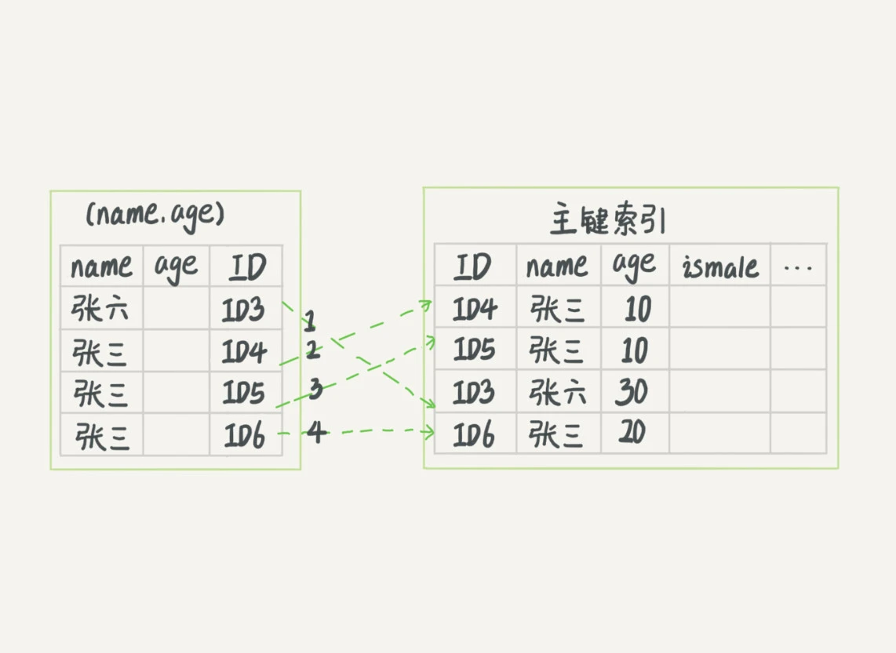
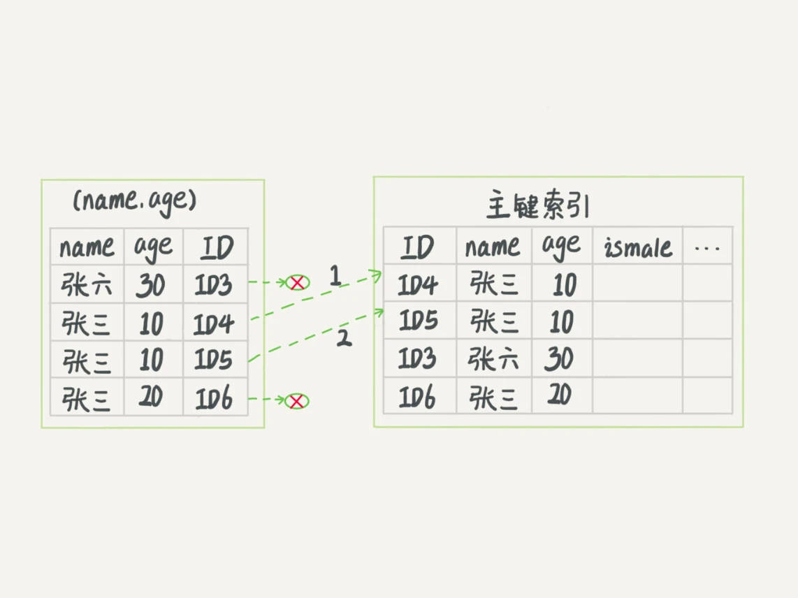
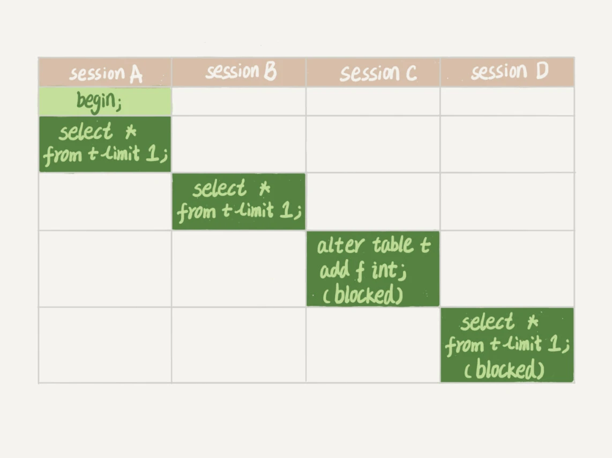

# 基础

## 架构

> server 层
> 1. 连接器：建立连接，校验账号密码
> 2. 分析器：了解要“干什么”，包括词法分析和语法分析。syntax 错误，不存在的表/列错误，没有操作表的权限错误，会在这个阶段抛出
> 3. 优化器：解决“怎么干”，生成执行计划，选择用哪个索引
> 4. 执行器：使用引擎提供的接口，操作数据
> 5. 查询缓存：在进入分析器之前，用SQL语句作为key，如果能在缓存中找到结果，则直接返回。缓存命中率一般情况下比较低，因为表/数据的变动，会清除相关的缓存。Mysql8.0 开始已废弃

> 存储引擎层
> 负责数据读取存储，提供操作数据接口
> 常见引擎有：InnoDB，MyIASM，Memory

## 日志系统: binlog & redo log
> binlog 属于 server 层；redo log 属于 innodb 层
> binlog 是逻辑日志， 使用追加写，用于备份恢复；redo log 是物理日志，使用重复写，用于保证 crash safe
> redo log 为了和 binlog 数据状态保持一致，使用了两阶段提交。这也是分布式数据之间保持数据一致性的常见做法

> 一条更新SQL：update T set c=c+1 where ID=2; 的执行流程如下

## 事务
> 在引擎层实现，MyIASM 不支持事务
> ACID（Atomicity, Consistency, Isolation, Durability）

> Isolation
> 不同的隔离级别解决了特定的问题，也引入了一些新问题
> 读未提交（Read Uncommitted）：存在脏读的问题，没有视图概念
> 读已提交（Read Committed）：解决了脏读问题，存在不可重复读问题，每条SQL执行前开启一个视图
> 可重复读（Repeatable Read）：解决了不可重复读问题，存在幻读问题，事务开始后执行的第一条SQL开启一个视图
> 串行化（Serializable）：读操作加读锁，写操作加写锁，没有视图概念

> 视图（一致性读视图，consistent read view）
> 支持 RC 和 RR 的实现
> 每条数据，都有一个隐藏列 trx_id，即修改数据的事务id
> 更新数据时，会更新数据的 trx_id 并生成一条 undo log
> 下图中的箭头 U1、U2、U3 就是 undo log, V1、 V2、 V3 是通过 undo log 生成的
> 

### 一致性读
>
> <b>满足以下规则</b>：
> 1. 自己更新的数据总是可见
> 2. 未提交，不可见
> 3. 已提交，但是是在视图创建前提交，不可见
> 4. 已提交，在视图创建前提交，可见
>
> <b>具体实现</b>
> 1. 视图开启时，维护一个当前活跃的事务数组，数组里最小的事务ID称为低水位；当前事务ID+1的值称为高水位。这个数组和高水位组成了当前事务的一致性视图
> 
> 2. 对于一个数据版本的 trx_id，存在以下几种情况
>> a. 如果落在绿色部分（小于低水位），表示这个数据时在视图创建前提交的，可见
>> b. 如果落在红色部分（大于等于高水位），表示这个数据是在未来的事务提交的，不可见
>> c. 如果落在黄色部分，分两种情况讨论
>>> α. 如果数据 trx_id 不在数组中，表示这个数据是在视图创建前提交的，可见
>>> β. 如果数据 trx_id 在数组中，表示这个数据是在视图创建前提交的，不可见

## 索引
> 索引相当于书本的目录，目的是提高数据查询效率

> 常见的索引数据结构
> 1. 字典表：支持快速等值查询，不支持范围查询，支持快速动态增删数据
> 2. 有序数组：支持快速等值查询、范围查询，不支持快速动态增删数据
> 3. 二叉平衡搜索树：支持快速等值查询、范围查询、动态快速增删数据
> 4. B+Tree树：在 BST 的基础上改进，是一种N叉树，可以有效降低磁盘IO次数，一个包含10亿个key的整数索引树，树高是4（一个节点大小是16KB，以bigint 为例，一个key占8B，每个key有个6B的指针指向子树， 一个节点可以存 16K/14B = 1170 个key， 1170的3次方是16亿），查询最多只需要3次IO

> Mysql 索引在引擎层实现。MyISAM 和 InnoDB 用的都是 B+Tree，但实现上有些差别。MyISAM 叶子节点存的是数据指针，InnoDB 叶子存的是数据（主索引树）或者主键（普通索引树）
> <b>覆盖索引</b>：查询数据被包含在二级索引表中，不需要回表的场景。例如这条SQL：select id from t where k = 10; 其中id是主键，k是普通索引
> <b>最左前缀匹配</b>：可以使用字符串索引最左M个字符，或者联合索引最左N个字段查询
> <b>索引下推</b>：Mysql5.6引入，对索引中包含的查找条件先过滤，如果需要再回表。例如这条SQL：select * from t where name like '张%' and age = 10;

> 无索引下推
> 

> 有索引下推
> 

## 锁

> <b>全局锁</b>
> flush tables with read lock; 通过命令 unlock tables 或者关闭连接时，或者遇到异常时释放锁。这条命令会让数据库处于只读状态，比如用在全库备份。mysqldump -single-transaction 也可以做整库备份，但需要引擎支持可重复读。
>
> set global readonly = true; 这条命令也会让整库处于只读状态。遇到异常时不会自动变更状态

> <b>表级锁</b>
> 包括表级锁和 MDL 锁
>
> 表级锁可通过命令：lock tables xxx read/write; 来开启
> 当前会话给表 t 加读锁后，所有会话只能读表 t
> 当前会话给表 t 加写锁后，当前会话能读写表 t，其他会话不允许读写表 t 
>
> MDL(metadata lock)：用来隔离 DML 和 DDL 操作。DML 操作默认加 MDL 读锁，事务提交后默认释放锁；DDL 默认加 MDL 写锁，提交后自动释放。
> 读锁之间不互斥，读写、写锁之间互斥
> 需要注意的时，当写锁等待时，后续的读锁也会进入等待，例如下图这个例子，D 因为 C 也被阻塞了
> 

><b>行锁</b>
> 两阶段锁协议：在 InnoDB 事务中，行锁是在需要的时候才加上的，但并不是不需要了就立刻释放，而是要等到事务结束时才释放。如果你的事务中需要锁多个行，要把最可能造成锁冲突、最可能影响并发度的锁尽量往后放。
