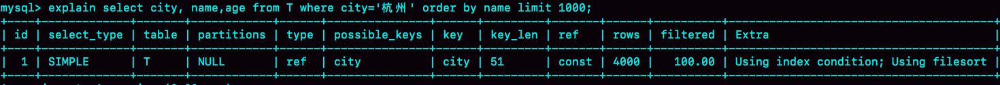
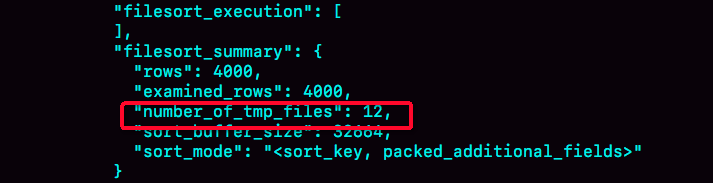
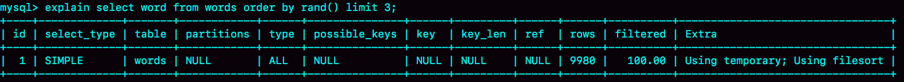

# 排序

> 我们在开发时，经常会碰到排序的场景。比如我们现在需要查询：杭州这座城市的居民，按名字排序后，取出前1000条数据。表结构如下
```
CREATE TABLE `t` (
  `id` int(11) NOT NULL,
  `city` varchar(16) NOT NULL,
  `name` varchar(16) NOT NULL,
  `age` int(11) NOT NULL,
  `addr` varchar(128) DEFAULT NULL,
  PRIMARY KEY (`id`),
  KEY `city` (`city`)
) ENGINE=InnoDB;
```
> SQL 可以这样写：select city,name,age from t where city='杭州' order by name limit 1000;

## 全字段排序

> 用 explain 查看执行计划如下。Extra 字段中的“Using filesort”表示用到了排序，Mysql 会给每个线程分配一块内存用于排序，称为 sort buffer。


> 这个语句的执行流程如下
> 1. 确定 sort buffer 存入 city, name, age 三个字段
> 2. 在 city 索引，找到第一个满足“city = 杭州”的记录的主键ID
> 3. 回到主表取出 city, name, age 字段，存入 sort buffer 中
> 4. 从 city 索引上取下一条记录的主键ID
> 5. 重复 2，3 步骤，直到不满足条件为止
> 6. 对 sort buffer 按照 name 进行排序
> 7. 取前1000条数据，返回给客户端

> 这个排序过程，称为“全字段排序”，执行流程图如下


> 排序的过程，可能在内存中完成，也可能需要使用外部排序（磁盘中），取决于排序需要的内存和参数 sort_buffer_size。 如果排序需要的内存小于 sort_buffer_size, 就在内存中完成，否则就需要利用磁盘辅助完成排序
> 用下面的方法，可以确定一个排序语句是否使用了临时文件

```bash
/* 打开optimizer_trace，只对本线程有效 */
SET optimizer_trace='enabled=on'; 

/* @a保存Innodb_rows_read的初始值 */
select VARIABLE_VALUE into @a from  performance_schema.session_status where variable_name = 'Innodb_rows_read';

/* 执行语句 */
select city, name,age from t where city='杭州' order by name limit 1000; 

/* 查看 OPTIMIZER_TRACE 输出 */
SELECT * FROM `information_schema`.`OPTIMIZER_TRACE`\G

/* @b保存Innodb_rows_read的当前值 */
select VARIABLE_VALUE into @b from performance_schema.session_status where variable_name = 'Innodb_rows_read';

/* 计算Innodb_rows_read差值 */
select @b-@a;
```
> 从 number_of_tmp_files 中看出是否使用了临时文件，值代表使用的临时文件数量。外部排序使用了归并排序算法。Mysql把数据分成多份，每一份单独排序后存在文件中，再把多个文件合并成一个有序文件。

> sort_buffer 越小，需要分成临时文件的数量越多

## rowid 排序

> 在上面的过程中，只对原表的数据读取了一遍，剩下的在 sort buffer 或者临时文件中完成。但这个算法有一个问题，就是如果要查询的字段过多，sort buffer 里要放的字段太多，这样能存下的行会很少，要分成很多个临时文件，排序的性能会很差。所以单行如果很大，这个方法效率不高。

> 那么，如果 Mysql 认为单行数据过大会怎么做呢？我们来修改一个参数，让 Mysql 采用另外一种算法
```
SET max_length_for_sort_data = 16;
```
> city, name, age 这三个字段总长度是36，超过了16。新算法放入 sort buffer 中的字段，只有 name 和主键ID。
> 执行过程如下
> 1. 确定 sort buffer 存入 name, ID 三个字段
> 2. 在 city 索引，找到第一个满足“city = 杭州”的记录的主键ID
> 3. 回到主表取出 name, ID 字段，存入 sort buffer 中
> 4. 从 city 索引上取下一条记录的主键ID
> 5. 重复 2，3 步骤，直到不满足条件为止
> 6. 对 sort buffer 按照 name 进行排序
> 7. 取前1000条数据，根据主键 ID 回主表查出 city, name, age 三个字段，返回给客户端

> 这个执行流程图如下，称为“rowid排序”


## 全字段排序 VS rowid 排序

> 结论：rowid 会回表造成多读磁盘，不会被优先选择

## 临时表 & 排序

> 我们现在有这样一个需求，从英语单词表中随机获取三个单词。
> 建表和数据初始化语句如下
```
CREATE TABLE `words` (
  `id` int(11) NOT NULL AUTO_INCREMENT,
  `word` varchar(64) DEFAULT NULL,
  PRIMARY KEY (`id`)
) ENGINE=InnoDB;

delimiter ;;
create procedure idata()
begin
  declare i int;
  set i=0;
  while i<10000 do
    insert into words(word) values(concat(char(97+(i div 1000)), char(97+(i % 1000 div 100)), char(97+(i % 100 div 10)), char(97+(i % 10))));
    set i=i+1;
  end while;
end;;
delimiter ;

call idata();
```

> 查询 SQL 语句：select word from words order by rand() limit 3;
> 用 explain 命令查看语句执行情况如下：

> Extra 字段显示 Using temporary，表示用到了临时表；显示 Using filesort，表示用到了排序
> 由于 order by rand() 使用了内存临时表，rowid 排序多出来的回表过程在内存中执行，并不会增加磁盘操作，因此和上面的分析不一样，这里会优先选择 rowid 排序
> 执行过程如下
> 1. 创建临时表，表有两个字段，一个字段是 word， 另一个字段是 rand
> 2. 遍历主表，取出 word 字段，调用 rand() 计算0～1之间的随机值，分别放入临时表 word，rand字段
> 3. 初始化 sort buffer
> 4. 从临时表中取出 rand 字段和地址值，放入 sort buffer 中
> 5. sort buffer 按 rand 排序，<font color="red">这里用的是堆算法</font>
> 6. 取前三个记录的位置信息，会到临时表中取出 word 字段返回给客户端


### 磁盘临时表

> 内存临时表大小由参数 tmp_table_size 决定，默认大小为16M。如果临时表大小超过了这个值，则用磁盘临时表
