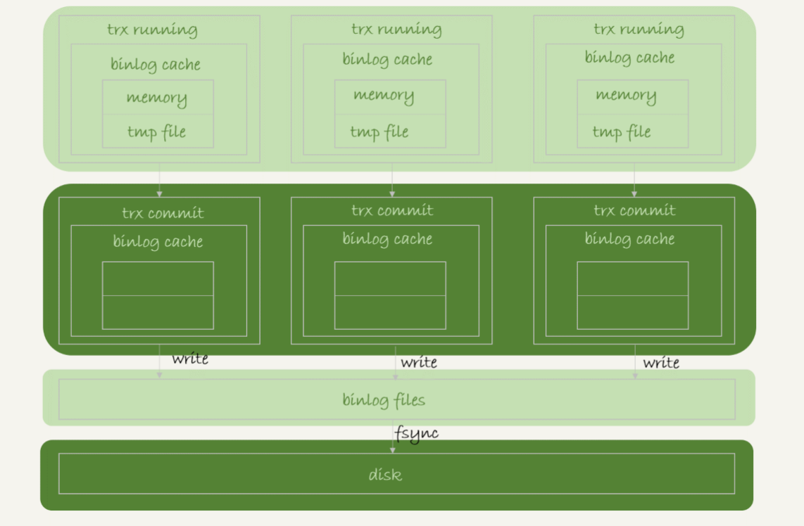
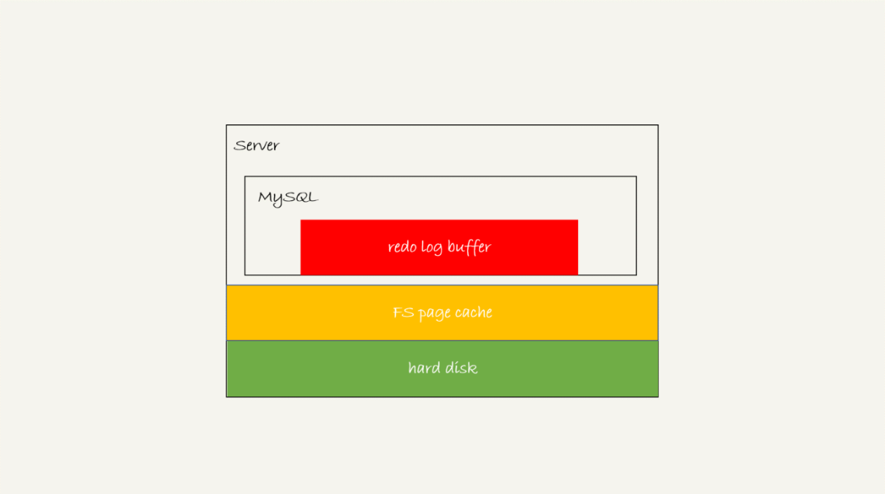
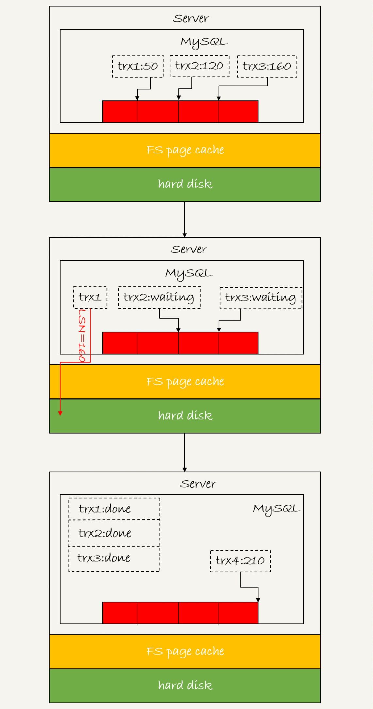
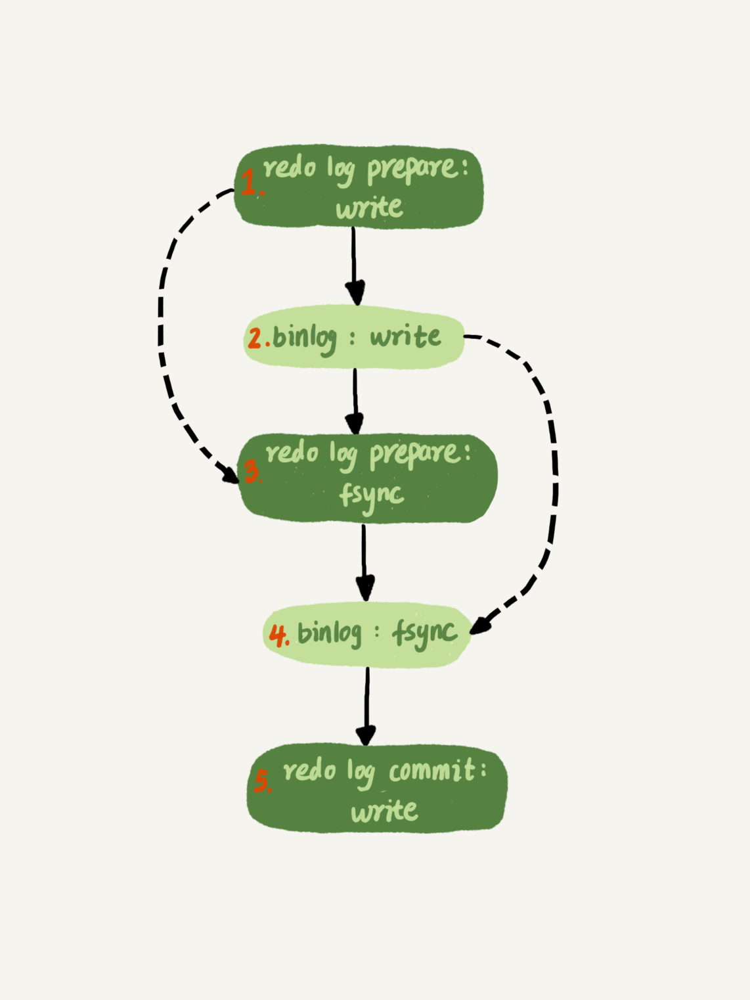

# 日志

> 基础知识部分简单提过，日志主要包含属于 Server 层 binlog，和属于 InnoDB 的 redolog 两块，这部分我们展开讲讲这两个日志的写入机制和在主备复制、高可用方面的作用

## binlog的写入机制

> 事务执行过程中，先把日志写入binlog cache，事务提交时，再把 binlog cache 写入 binlog 文件中
> Mysql 给 binlog cache 分配了一块内存，每个线程一个，大小受到参数 binlog_cache_size 控制，如果超出这个大小，就要暂存到磁盘中
> 所有线程共用一份 binlog 文件

> 上图展示了事务提交时，把binlog cache 写入 binlog 文件，并清空 binlog cache
> 图中的 write，指的是把日志写入文件系统对应的 page cache，并没有把数据持久化到磁盘，所以速度是比较快的
> 图中的 fysnc，才是把数据持久化到磁盘的操作
>
> write 和 fsync 的时机，是由参数 sync_binlog 控制的
> sync_binlog=0 时，表示每次事务提交时只执行 write
> sync_binlog=1 时，表示每次事务提交时都执行 fsync
> sync_binlog=N (N > 1) 时，表示每次事务提交时都执行 write，只有积累到 N 个事务后才执行 fsync

## redo log 的写入机制

> redo log也有三种状态

> 存在 redo log buffer 中，物理上是在 Mysql 线程内存中，对应图中的红色部分
> 写到磁盘（write），但还没持久化（fsync），物理上是在文件系统的 page cache 中，对应图中的黄色部分
> 持久化到磁盘，对应图中红色部分
> 
> 写入策略受到参数 innodb_flush_log_at_trx_commit 控制
> innodb_flush_log_at_trx_commit=0时，表示事务提交时只把 redo log 留在（事务执行的过程中，redo log 是直接写入 redo log buffer 的） buffer 中
> innodb_flush_log_at_trx_commit=1时，表示事务提交时把 redo log 持久化到磁盘
> innodb_flush_log_at_trx_commit=2时，表示事务提交时把 redo log write 到磁盘
>
> 除了上面的写入时机，redo log 还有下面几种情况会执行写入
> InnoDB 有个后台线程，每隔1秒，会把 redo log buffer 中的日志写入到文件系统的 page cache 中，然后再持久化到磁盘中
> redo log buffer 占用的空间即将达到 innodb_log_buffer_size 的一半的时候，后台线程会写盘
> 并行事务提交时，顺带将其他事务的 redo log buffer 一起写盘。因为 redo log buffer 时所有线程共用的，假设事务A执行到一半，已经将一些变更写入到 redo log buffer 中了，这时事务B要提交了，会将事务A这部分变更也写入磁盘。

### 组提交（group commit）

> InnoDB 的事务提交分成了两阶段：prepare 和 commit。这两次写盘，并不是每个事务只写自己的日志，而是把当前处于 prepare 或者 commit 阶段的事务日志一起写盘。本质上就是批处理
> 日志逻辑序列号 LSN（Log Sequence Number）: 单调递增，对应 redo log 的写入点，每次写入长度为 length 的日志，相应的 LSN 就会增加 length
>
> 下图是三个并发事务（trx1，trx2，trx3）在 prepare 阶段，都写完 redo log buffer，持久化到磁盘的过程。

> 1. trx1 是第一个到达的，会被选为这组的 leader；
> 2. 等 trx1 要开始写盘的时候，这个组里面已经有了三个事务，这时候 LSN 也变成了 160；
> 3. trx1 去写盘的时候，带的就是 LSN=160，因此等 trx1 返回时，所有 LSN 小于等于 160 的 redo log，都已经被持久化到磁盘；
> 4. 这时候 trx2 和 trx3 就可以直接返回了。
> **一次组提交里面，组成员越多，节约 IOPS 的效果越好。同样，第一个写完 redo log 的事务，接下来越晚调用 fsync，组员越多，节约 IOPS 效果越好。**
>
> 为了让 fsync 带的组员更多，Mysql 有个有趣的优化：拖时间。

> Mysql 为了让组提交效果更好，把 redo log 调用 fsync 放到了 binlog write 后面。
> 而且引入了两个参数
> binlog_group_commit_sync_delay：表示延迟多少微秒后才调用 fsync
> binlog_group_commit_sync_no_delay_count：表示累积多少次以后才调用 fsync

### 可靠性和性能的权衡

> 可靠性主要靠“双1”配置，即 sync_binlog 和 innodb_flush_log_at_trx_commit 都设置成1。
> 提升性能可以从下面着手
> 1. 设置 binlog_group_commit_sync_delay 和 binlog_group_commit_sync_no_delay_count 参数，减少 binlog 的写盘次数。这个方法是基于“额外的故意等待”来实现的，因此可能会增加语句的响应时间，但没有丢失数据的风险。
> 2. 将 sync_binlog 设置为大于 1 的值（比较常见是 100~1000）。这样做的风险是，主机掉电时会丢 binlog 日志。
> 3. 将 innodb_flush_log_at_trx_commit 设置为 2。这样做的风险是，主机掉电的时候会丢数据。

## binlog 格式

> statement：记录 SQL 语句原文，拿到从库执行后可能会出现跟主库数据不一致的情况
> row：记录了字段的具体数值。配合 binlog_row_image = Full 可以做数据恢复
> mix：由 Mysql 自行决定什么时候用 statement 格式，什么时候用 row 格式
>
> **虽然 row 格式的 binlog 占用空间大，且可能会降低 IO 性能，但是它有不可替代的优点：防止主备数据不一致，且一旦出现不一致的情况能及时发现；能够恢复数据**