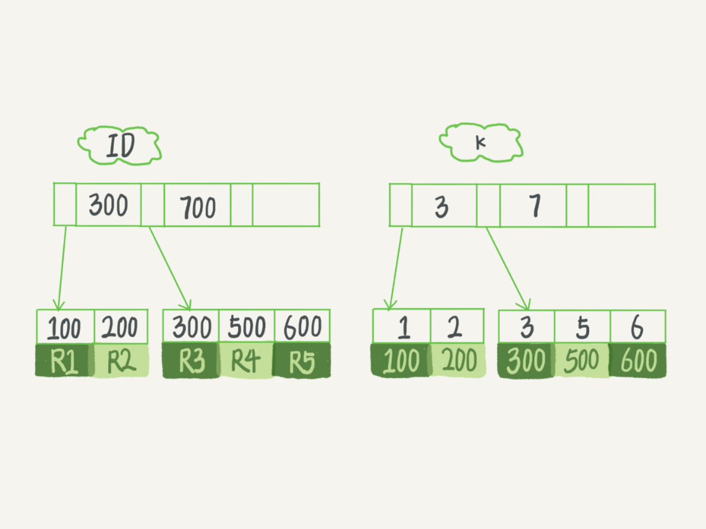

# 索引

## 普通索引 VS 唯一索引

> 以表T为例，建表语句如下，假设字段k都不重复，考虑在k上建普通索引或者唯一索引
```bash
mysql> create table T(
id int primary key, 
k int not null, 
name varchar(16),
index (k))engine=InnoDB;
```


### 查询过程

> 假设查询语句是：select id from T where k=5
>
> <b>普通索引</b>：查找到满足条件的第一个记录(5,500)之后，需要继续在右边查找下一个记录，直到条件不满足为止
>
> <b>唯一索引</b>：查找到满足条件的第一个记录(5,500)之后就停止了
>
> <b>结论</b>：由于 InnoDB 数据是按页为单位读写的。当需要读一条记录时，会把整页的数据加载到内存中，普通索引查找到第一条记录的后续比较操作是在内存中进行，因此两者性能差别不大

### 更新过程

> <b>change buffer</b>：更新数据页时，如果数据页已经在内存中，则直接更新；否则在不影响数据一致性的前提下，InnoDB会把这些更新操作缓存在change buffer中。在下次读取这个数据页，或者数据库关闭前，会将change buffer中的操作应用到数据页，这个过程称为 merge。除此之外，后台线程也会定期 merge
>
> 什么情况下可以使用change buffer？对于唯一索引来说，所有的更新都要检查是否违反唯一性约束。也就是检查数据是否已经存在，这会将数据页读到内存中，既然数据页已经在内存中了，就不必再使用change buffer了。所以只有普通索引才可以使用change buffer

> 数据页在内存中：普通索引和唯一索引操作区别不大
> 数据页不在内存中：普通索引写入change buffer，比唯一索引要读入数据页到内存中块许多

> <b>结论</b> 在普通索引，写多读少的场景下，change buffer的使用效果最好。比如日志类、账单类的系统

> <b>redo log Vs. change buffer</b>
> 简化抽象一个更新操作涉及的步骤
> 1. 从磁盘中读入待更新数据所在数据页到内存中，这一步涉及随机读
> 2. 对内存中的数据执行变更操作
> 3. 将变更从内存中写入磁盘，这一步涉及涉及随机写
>
> redo log：节省磁盘随机写时间消耗（步骤3），改成顺序写
> change buffer：节省磁盘随机读时间消耗（步骤1）

## 优化器如何选择索引
> 从以下几个方面考虑
> 1. 扫描数据行数，是否需要回表
> 2. 是否使用临时表
> 3. 是否需要排序

### 选错索引的场景和解决方法