# 锁

> 基础知识部分已经了解过表锁和行锁了，这部分主要介绍下间隙锁和 next-key lock

## 间隙锁

> 每行数据是可以加锁的实体，数据和数据之间的空隙也是可以加锁的实体，加在间隙上的锁我们称为间隙锁

### 幻读

> 再进一步了解间隙锁的机制前，我们先来了解下它出现的背景，一句话概括，间隙锁的出现是为了解决幻读问题。
>
> 幻读：前后两次读取相同范围的数据时，后一次读出了前一次没有出现的行。幻读只在当前读时出现，重点是读到了新的行（除了 insert 语句能够插入新数据，update 也可能把数据写入到当前读到的范围内）

### 幻读（没有间隙锁时）带来的问题
>
> 结合以下面的表和数据来分析下这个SQL：select * from t where id = 5 for update; 
```
CREATE TABLE `t` (
  `id` int(11) NOT NULL,
  `c` int(11) DEFAULT NULL,
  `d` int(11) DEFAULT NULL,
  PRIMARY KEY (`id`),
  KEY `c` (`c`)
) ENGINE=InnoDB;

insert into t values(0,0,0),(5,5,5),
(10,10,10),(15,15,15),(20,20,20),(25,25,25);
```

> 1. 破坏语义
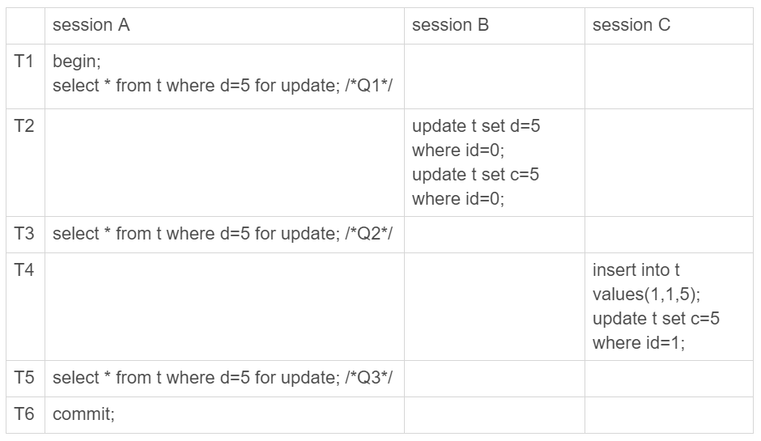
> Session A 在 T1 时刻声明：“我要把表d=5的行锁住，不允许其他事务进行读写”
> 由于 Session A 只给 id = 5 这行加了行锁，所以 Session B 和 Session C 的更新操作依然能被执行

> 2. 数据不一致
> 数据的一致性，不仅表现在数据之间，也表现在数据和日志之间。为了说明这个问题，给 Session A 再加一个更新语句
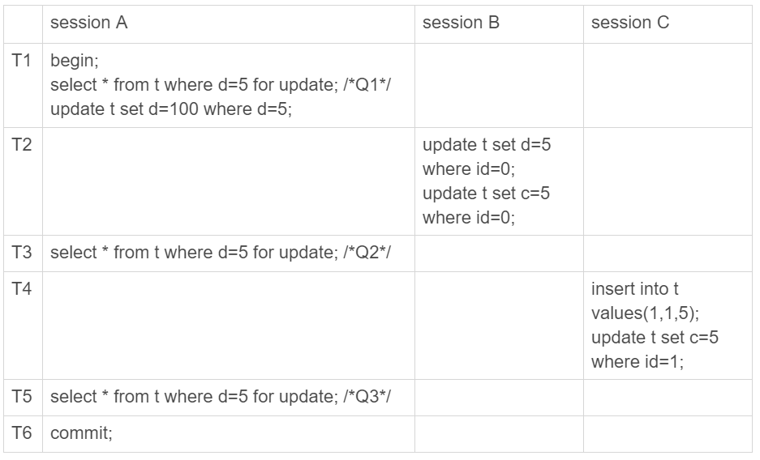
> 我们来分析下这些语句执行完后，数据库中的数据是什么
>> T1时刻后：（5，5，5）这行数据变成了 （5，5，100）
>> T2时刻后：（0，0，0）这行数据变成了 (0，5，5)
>> T4时刻后：多了一行（1，5，5）数据 
>> T6时刻后：表t的数据是：（0，5，5），（1，5，5），（5，5，100），...
>
> 再来看下这些语句执行完后，binlog会是怎样。请记住 binlog 是 commit 时才写入文件的
>> T2时刻后：写入 Session B 的语句
>> T4时刻后：写入 Session C 的语句
>> T6时刻后：写入 Session A 的语句，此时表 t 的数据是：（0，5，100），（1，5，100），（5，5，100），...
>
> <font color="red">数据库里的数据和经过 binlog 恢复的数据出现了不一致</font>

### 如何解决幻读

> 前面出现问题的原因是，我们只给 id = 5 这行数据加上锁。那如果给扫描到的所有行都加上锁，结果又会如何呢？
> select * from t where id = 5 for update; 查询会遍历主表，所以所有的行都会上锁
> 因此 Session B 试图更新 id = 0 的操作会被 block，但 Session C 新插入 id = 1 的操作还是正常执行。可见还不能完全解决问题

> 行锁只能锁住行，但是新插入记录这个操作，要更新行之间的间隙。因此，为了解决幻读问题，引入了间隙锁。
> 在扫描行的过程中，不仅给行加上了行锁，也给行之间的间隙，加上了间隙锁
> 行锁分为读锁和写锁，锁之间的冲突关系是：除了读锁之间，其他两两互斥
> 但间隙锁有点特殊，<font color="red">和间隙锁冲突的，是往这个间隙里插入一条记录的操作</font>
> 间隙锁和行锁合称 next-key lock，每个 next-key lock 都是前开后闭区间。
> 间隙锁只在事务隔离级别为可重复读下出现。

## 加锁规则

> 两个原则，两个优化和一个bug
>
> 原则一：加锁的基本单位是 next-key lock
> 原则二：查找过程中访问到的对象才加锁
> 优化一：等值查询，给唯一索引加锁时，next-key lock 退化为行锁
> 优化二：等值查询，向右遍历碰到不满足条件的值时，next-key lock 退化为间隙锁（实验时，发现范围查询也会退化，见案例三、四）
> 一个bug：唯一索引上的范围查询会访问到不满足条件的第一个值为至（实验时，发现bug已经被修复，见案例五）
>
> 这个规则只限于截止到现在的最新版本，即 5.x 系列 <=5.7.24，8.0 系列 <=8.0.13。

> 下面通过几个案例，来进一步解释下这些规则
>
> **案例一：等值查询间隙锁**
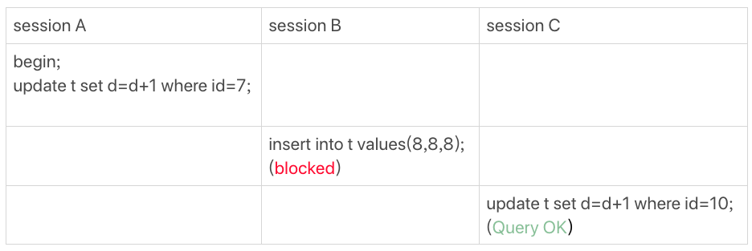
> 解释：表中没有 id=7 的记录，根据原则一，加 (5, 10] next-key lock，再根据优化二，退化为间隙锁(5,10)
>
> **案例二：非唯一索引等值锁**
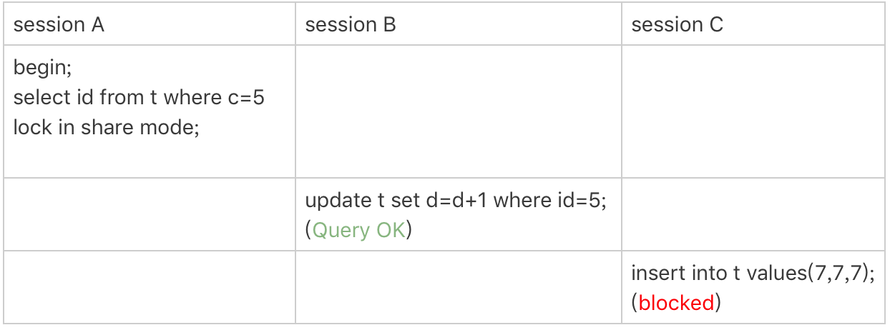
> 解释：先加（0, 5] next-key lock，由于不是唯一索引，会继续向右查询，加(5, 10] next-key lock，碰到 c=10 的记录不满足条件后停止。由于使用了 lock in share mode 且查询值是 id，因此在索引 c 上查询且不需回表。Session B 可以正常获取 id=5 的行锁，Session C 需要往索引c 区间 (5,10] 上写入数据(c=7, id=7)被阻塞
>
> **案例三：主键索引范围锁**
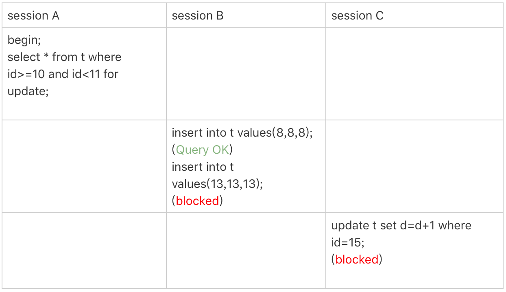
> 解释：找到第一个满足条件的记录 id=10，加 next-key lock (5, 10]，根据优化一，退化为行锁，继续向右查询，找到 id=15 记录，加 next-key lock (10, 15]。<font color="red">在 Mysql 8.4.5 上实验时，Session C 不会被阻塞</font>
>
> **案例四：非唯一索引范围锁**
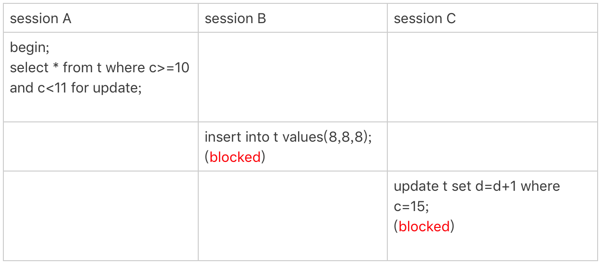
> 解释：索引c不是唯一索引，不能应用优化一，所以索引c加 (5,10] 和 (10, 15] 两个next-key lock。<font color="red">在 Mysql 8.4.5 上实验时，Session C 不会被阻塞</font>
>
> **案例五：唯一索引范围锁bug**
> 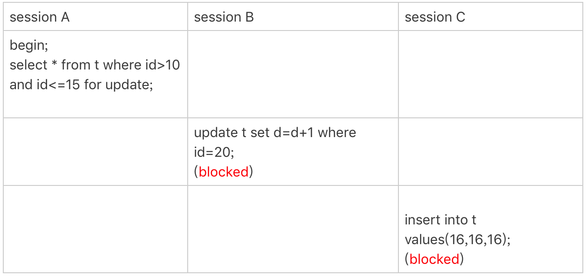
> ~~session A 是范围查询，应该给索引加上 next-key lock (10, 15]，并且id是唯一索引，应该扫描到id=15的行就停止了。但实现上，InnoDB会继续扫描到第一个不满足条件的行id=20才停止，所以还会加上 next-key lock (15, 20]~~。在 Mysql 8.4.5 上实验时，Session B 和 Session C 都不会被阻塞
>
> **案例六：非唯一索引上存在“等值”的例子**
> 这个例子是为了更好的说明“间隙”这个概念，这里给表插入一条新的记录
```
mysql> insert into t values(30,10,30);
```
> 可以看到有两条c=10的记录，由于他们的主键id值不同，因此他们之间也是有间隙的
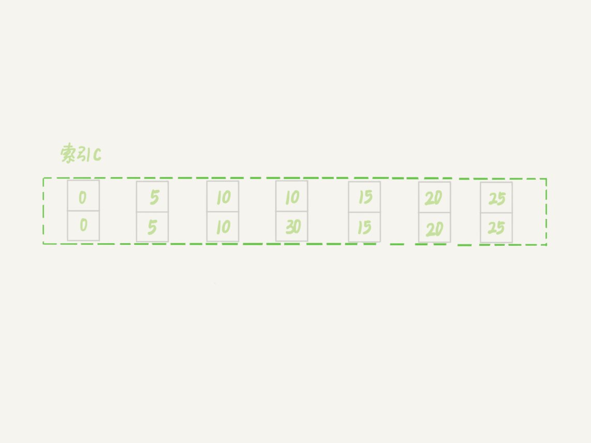
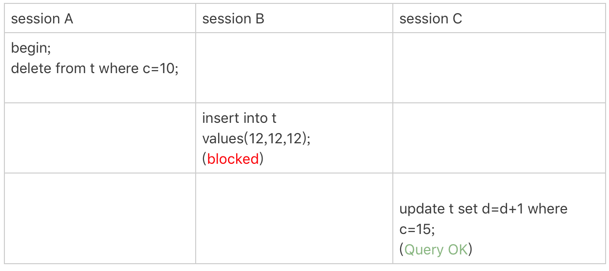
> 解释：delete 语句和 select ... for update 的加锁规则一样。找到第一条记录(c=10, id=10)，加 next-key lock (5, 10], 继续向右遍历，加 next-key lock (10, 15]，后退化成间隙锁 (10, 15)
>
> **案例七：limit语句加锁**
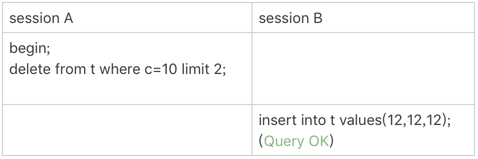
> 解释：对比案例六，delete 加不加 limit 2，两者结果上是一样的，但是加锁的逻辑却有一点差异。扫描到记录(c=10, id=30)时，已经满足数量要求了，语句就结束了。这个例子对我们的启发是：<font color="red">delete 语句尽可能加上limit</font>
>
> **一个死锁的例子**
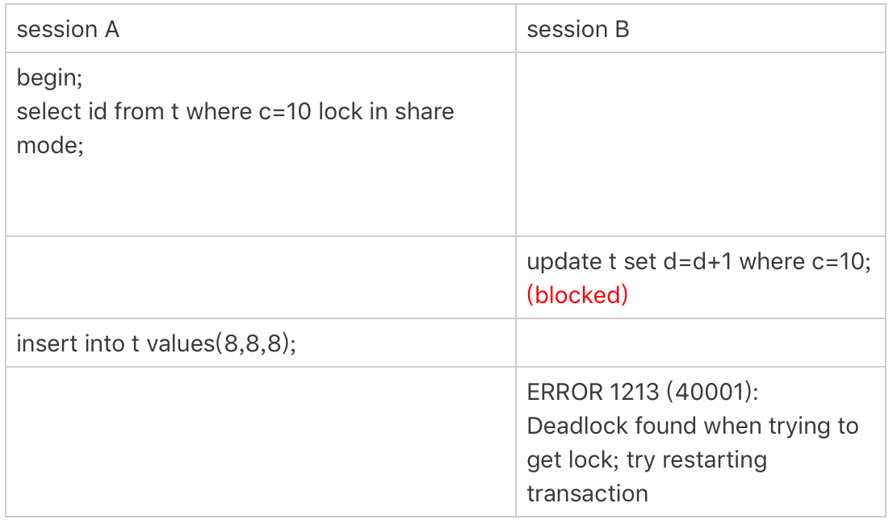
> 解释：
> Session A 加 next-key lock (5, 10] 和间隙锁 (10, 15)
> Session B 先加间隙锁(5,10)成功，阻塞在获取c=10行锁上。加锁是分成间隙锁和行锁两段来执行的
> Session A 被 Session B 的间隙锁阻塞，造成死锁