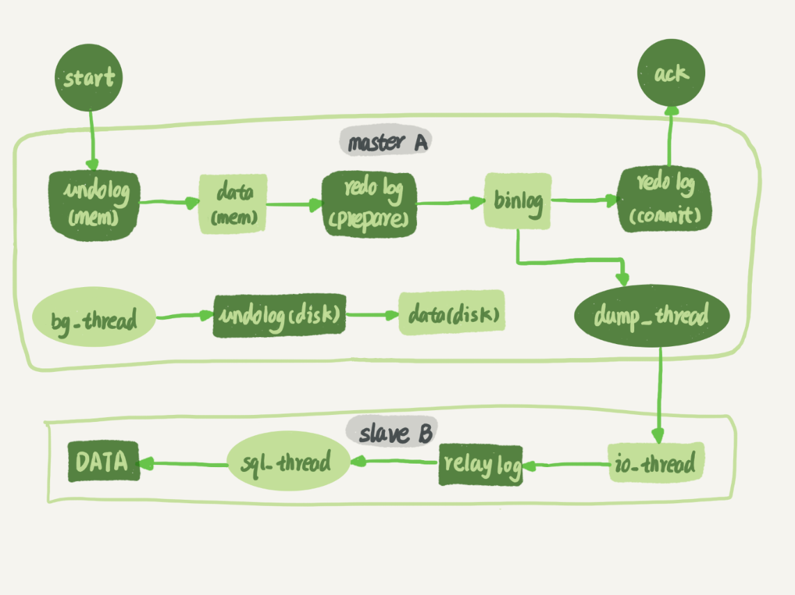
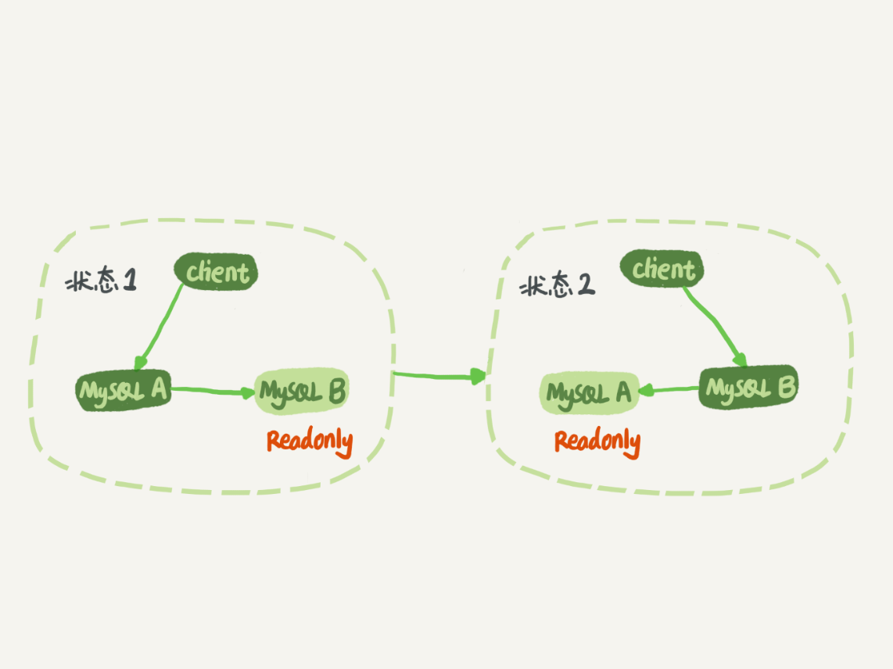
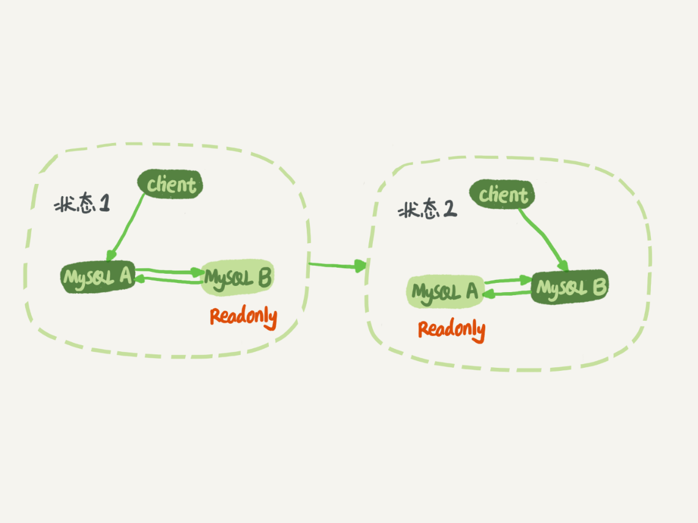
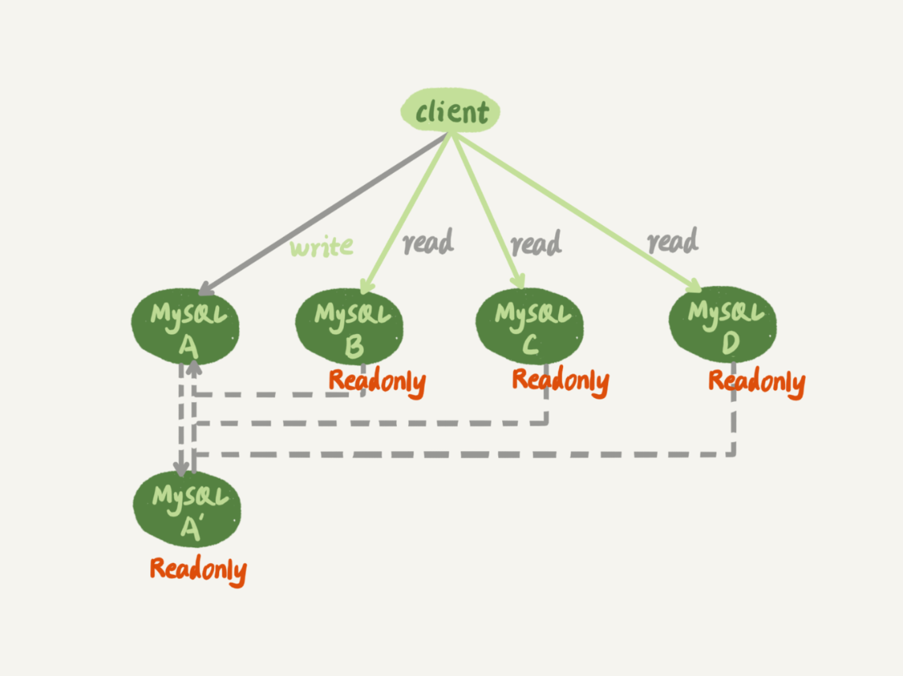
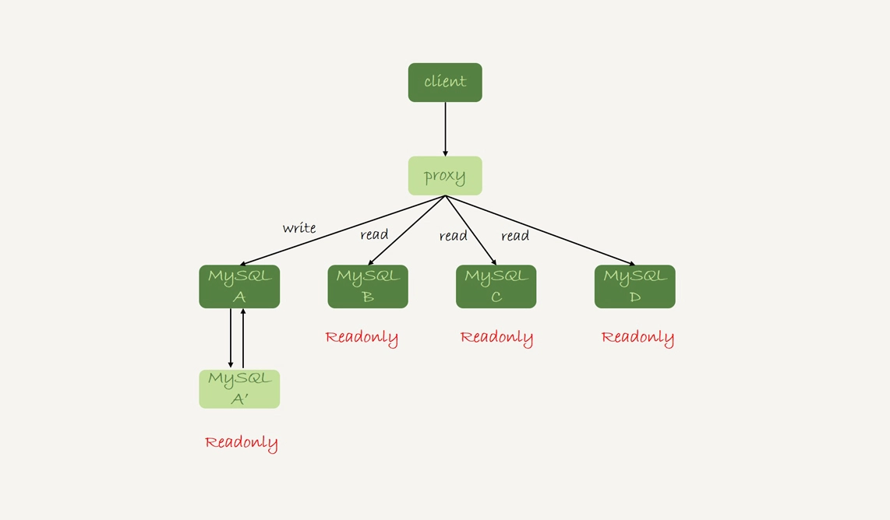
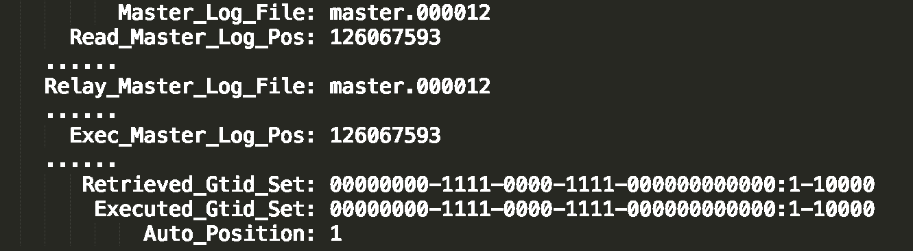
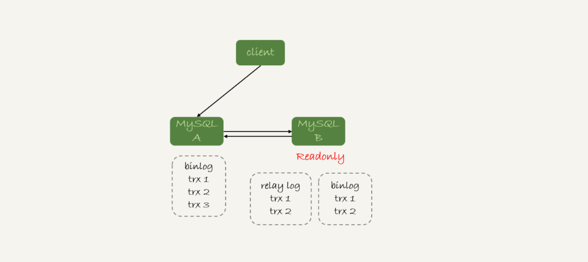
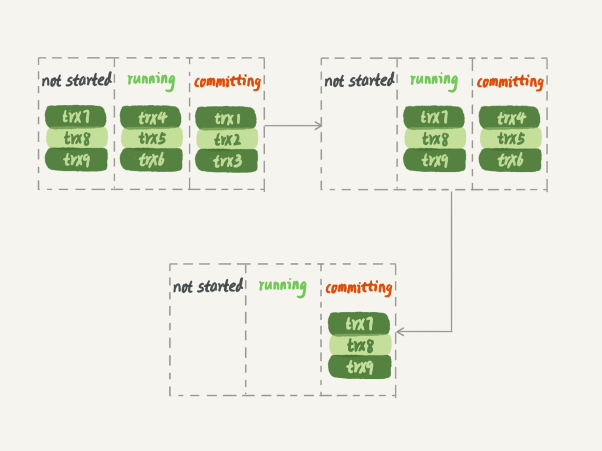
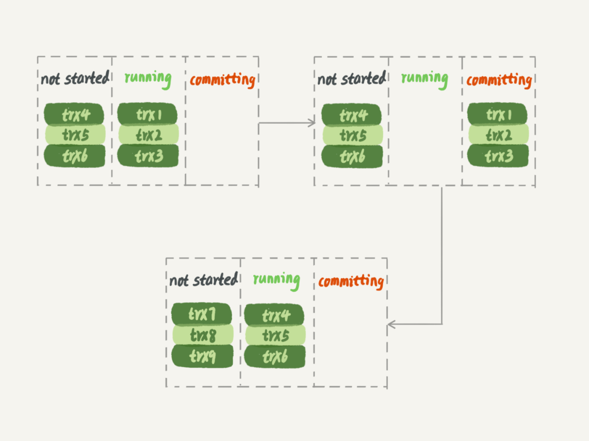
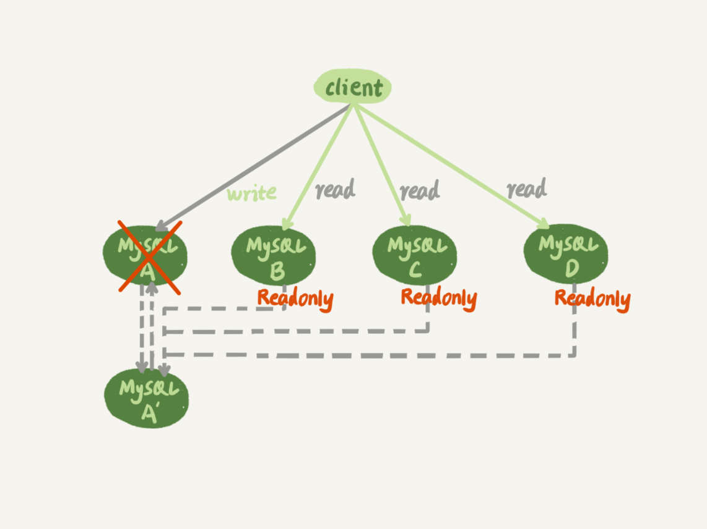

# 高可用

> 主库和备库之间通过 binlog 同步数据，一条更新语句的同步流程如下。主备之间是通过 binlog 来保持数据同步的


## 一主一备

> 架构图如下，主备切换时要改变主备关系


## 双主

> 架构图如下

>
> **解决循环复制问题**
> 问题描述：A 的 binlog 会同步到 B，B 执行 A 的 binlog 过程中也会写 binlog（log_slave_updates = ON），B 产生的 binlog 再同步给 A，A 会把执行过的操作再执行一次，如此循环下去不会终止。
> 解决方法：A，B允许互为主备关系的前提是，彼此的 server ID 不一样。binlog 里记录了初始更新操作的 Server ID，B 执行 relay log 产生的 binlog 中记录的 Server ID 也是 A，当 A 同步这部分 binlog 时，判断是自己产生的，便不再执行


## 一主多从

> 大多数业务都满足写少读多场景，因此我们会启用多个从库（从库和备库，本质上都是只读库，这里把HA重新选主过程中会可被选为master的库称为备库），来分担主库的压力。同时也能避免业务系统和数据分析系统，等不同系统读数据时相互影响
> 
> 上图这种架构把服务端的信息放在在了客户端（一般会采用 ZK 来做服务注册发现），由客户端来做负载均衡。现在更常见的架构是由代理层来做负载均衡
> 
>
> 主从延迟会导致读到系统过去状态的数据，我们称之为“过期读”。
> **解决过期读**
> 1. 强制走主库。
> 
> 2. Sleep一段时间再发起查询。部分场景下，前端可以在后端接口返回成功后，把用户输入的信息直接用于展示，省去一次马上查询，待用户主动发起刷新时，往往已经过去一段时间了，变相达到了 Sleep 的目的。这个方案不能做到精确判断主从延迟时间。
>
> 3. 判断主从无延迟。
>> a. 依据 show slave status 命令返回的 seconds_behinds_master 的值判断，为0是认为无延迟，精确到秒
>>
>> show slave status 返回的主要信息如下：
>> 
>>
>> b. 判断同步点位。Master_Log_File, Read_Master_Log_Pos 分别表示读到主库的最新日志和位置；Relay_Master_Log_File 和 Exec_Master_Log_Pos 表示从库执行同步的最新日志和位置，如果和前者一样，表示没有延迟
>>
>> c. 对比 GTID 集合。Auto_Position 表示启用 GTID 协议，Retrieved_Gtid_Set 表示读到的 GTID 集合，Executed_Gtid_Set 表示执行完成的 GTID 集合，两者一致表示无延迟。
>>
>> 相比 Sleep 方案，判断主从无延迟方案的准确度已经高了不少，但是还没达到精确的程度。为什么这么说呢？因为它忽略了主库写完 binlog，到从库接收到 binlog 这段时间。下图就是这么一个情况
>> 
>
> 4. 配合 semi-sync。要解决这个问题，就要引入半同步复制，也就是 semi-sync replication。
> semi-sync 做了这样的设计
>> a. 事务提交时，主库把 binlog 发给从库
>>
>> b. 从库接收到 binlog 后，给主库发一个 ack，表示收到了
>>
>> c. 主库收到从库的 ack 后，才给客户端返回事务完成的确认
>
> 判断点位/GTID + semi-sync，就能解决上面的问题。但这只适合一主一从的架构，因为主库收到任意一个从库的 ack 后就会给客户端返回结果。也就意味着，如果随后查询的操作不是落在给主库返回 ack 的从库上，这个问题依然会存在。
> 实际上，回到我们的业务场景上，我们并不是要求在从库完全没有延迟上才能发起查询（实际上不可能做到100%无延迟），如果主库的更新十分频繁，从库可能会一直处于追赶同步的状态。其实，只要刚刚发生更新操作，已经同步到从库即可满足我们的查询条件。
>
> 5. 等待主库点位。
> 先介绍一条命令：select master_pos_wait(file, pos[, timeout]);它是在从库执行的，file 和 pos 表示文件名和位置，timeout是超时时间，单位是秒，可选参数。这条命令正常返回一个整数N，表示从命令开始执行起，到应用完 file 和 pos 表示的 binlog 位置时，经过了 N 个事务，如果命令执行时，已经超过了该位置，返回0，如果超时返回-1。
>
> 具体的执行逻辑如下
>> a. 在主库上执行 show master status 得到当前的 file 和 pos
>> b. 在从库上执行 select master_pos_wait 命令，等待正常返回结果或者超时返回
>> c. 如果是正常返回则执行查询
>> d. 否则执行降级逻辑，到主库查询或者返回异常
>
> 6. 等 GTID。
> 同样的，Mysql 提供了类似的命令：select WAIT_FOR_EXECUTED_GTID_SET(gtid_set[, timeout]); 它的逻辑是，等待直到从库中已执行的事务包含这个 GTID，然后返回0，否则等待超时后返回1
>
> 在前面等位点的方案中，我们执行完事务后，还要主动去主库执行 show master status。而 MySQL 5.7.6 版本开始，允许在执行完更新类事务后，把这个事务的 GTID 返回给客户端，这样等 GTID 的方案就可以减少一次查询。
>
> 完整的流程如下
>> a. 在主库执行完事务后，拿到gtid
>> b. 在从库执行 select WAIT_FOR_EXECUTED_GTID_SET 命令
>> c. 返回0则执行查询
>> d. 否则执行降级逻辑
>
> 问题是，如何在事务执行完成后，从返回的数据包中获取 gtid。只需要将参数 session_track_gtids 设置为 OWN_GTID，然后通过 API 接口 mysql_session_track_get_first 从返回包解析出 GTID 的值即可。但 Mysql 并没有提供这类接口的 SQL 用法（可以用 select @@gtid_executed 命令查询所有gtid，但这里我们只需要本事务的gtid）。Java 目前是通过 JDBC 驱动来连接 Mysql 服务端的，JDBC 并没有暴露相关接口。

## 主备延迟

> binlog 能保证数据的最终一致性，这对于数据库的高可用要求来说还不够。
>
> 和数据同步有关的关键时间点
> 1. 主库执行完一个事务，写入 binlog，记为 T1
> 2. 之后传给备库，备库写入 relay log，记为 T2
> 3. 备库执行完这个事务，记为 T3
>
> 我们把 T3 - T1 这个时间差称为同步延迟，在备库上执行 show slave status 命令，这个值会显示在 seconds_behind_master 上。一般来说，网络正常的情况下 T2 - T1 的值是比较小的，延迟主要是因为第三步
>
> **延迟主要原因**
> 1. 备库机器性能不如主库机器
> 2. 备库压力大，比如很多慢 SQL 在备库上执行
> 3. 存在大事务（业务逻辑或者DDL），备库执行时间明显会增加
> 4. 备库的并行复制能力差，消费能力跟不上生产速度。在 Mysql 5.6 之前，sql_thread 是单线程
>
> **并行复制策略**
> 
> Mysql5.5 官方不支持并行复制，需要我们自行实现
> 1. 按表分发
>> a. 解析事务中用到的数据库和表，例如 db1.t1, db1.t2 
>> b. 每个 worker 线程维护了一张 hash 表，key 是当前同步中的库表，value 是数量， 判断当前 worker 线程的一个工作情况
>> c. 如果没有和 worker 线程冲突，例如当前所有的 worker 线程正在同步的库表都不涉及 db1.t1 和 db1.t2，则分发给最空闲的 worker 线程
>> d. 如果和1个 worker 线程冲突了，则分发给这个 worker 线程
>> e. 如果和多个 worker 冲突了，例如 worker1 当前 hash 表记录是 db1.t1: 1，worker 2 当前 hash 表记录是 db1.t2: 2。则当前事务进入等待，等待到只和1个 worker 线程冲突，分发给这个 worker 线程
>
> 2. 按行分发
>> 需要判断修改行的主键和唯一健，要求 binlog 格式必须是 ROW，这时 worker 的 hash 表记录的是 db.table.<索引名称>.<索引值>，如果涉及到唯一健的修改，必须记录修改前和修改后的值
>> 具体的逻辑类似按表分发
>
> Mysql5.6 并行复制策略
>> 官方支持按库复制，逻辑类似于在 Mysql5.5 上的实现，只不过粒度比较粗
>
> MariaDB 的并行复制策略
>> MariaDB 运用了 redo log 组提交的特性，同一组提交的事务，拥有相同的 commit_id，并记录到了 binlog 中。当其他策略把重点放在分析 binlog 上时，MariaDB 巧妙的模拟了主库并发提交事务
>> 明显的，拥有相同的 commit_id 的事务，在同步时分发到不同worker并发执行，待这组执行完后，再取下一组。
>> 但是这个策略有个问题，并没有完全模拟“在主库上的并发提交”。原因是当前一组事务在执行时，下一组事务完全处于等待状态，而在主库上，下一组事务可以处于运行中状态，这样当一组事务提交后，下一组可以很快的进入提交状态
>>
>> 主库的并行事务如下
>> 
>>
>> MariaDB 并行复制如下
>> 
>
> Mysql5.7 的并行复制策略
>> 在 MariaDB 并行复制实现之后，官方的 MySQL5.7 版本也提供了类似的功能，由参数 slave-parallel-type 来控制并行复制策略：配置为 DATABASE，表示使用 MySQL 5.6 版本的按库并行策略；配置为 LOGICAL_CLOCK，表示的就是类似 MariaDB 的策略。不过，MySQL 5.7 这个策略，针对并行度做了优化。这个优化的思路也很有趣儿。
>> 思考一个问题：同时处于运行中的事务可以并行复制吗？答案是不可以，原因是这其中有锁等待的事务。
>> 上面提到的 MariaDB 的策略是同时处于 commit 状态的事务可以并行，那么再思考一个问题：回忆一下 redo log 的两阶段提交，同时处于 prepare 状态的事务可以并行吗？答案是可以，处于 prepare 状态已经经过了锁检测了。
>> 因此 Mysql5.7 的并行复制思路是：
>> a. 同时处于 prepare 状态的事务，在备库执行时是可以并行的；
>> b. 处于 prepare 状态的事务，与处于 commit 状态的事务之间，在备库执行时也是可以并行的。
>
> MySQL 5.7.22 的并行复制策略
>> 在 2018 年 4 月份发布的 MySQL 5.7.22 版本里，MySQL 增加了一个新的并行复制策略，基于 WRITESET 的并行复制。相应地，新增了一个参数 binlog-transaction-dependency-tracking，用来控制是否启用这个新策略。
>> 这个参数的可选值有以下三种。
>> - COMMIT_ORDER，表示的就是前面介绍的，根据同时进入 prepare 和 commit 来判断是否可以并行的策略。
>>
>> - WRITESET，表示的是对于事务涉及更新的每一行，计算出这一行的 hash 值，组成集合 writeset。如果两个事务没有操作相同的行，也就是说它们的 writeset 没有交集，就可以并行。
>>
>> - WRITESET_SESSION，是在 WRITESET 的基础上多了一个约束，即在主库上同一个线程先后执行的两个事务，在备库执行的时候，要保证相同的先后顺序。
>> 当然为了唯一标识，这个 hash 值是通过“库名 + 表名 + 索引名 + 值”计算出来的。如果一个表上除了有主键索引外，还有其他唯一索引，那么对于每个唯一索引，insert 语句对应的 writeset 就要多增加一个 hash 值。
>> 你可能看出来了，这跟我们前面介绍的基于 MySQL 5.5 版本的按行分发的策略是差不多的。不过，MySQL 官方的这个实现还是有很大的优势：
>> - writeset 是在主库生成后直接写入到 binlog 里面的，这样在备库执行的时候，不需要解析 binlog 内容（event 里的行数据），节省了很多计算量；
>> - 不需要把整个事务的 binlog 都扫一遍才能决定分发到哪个 worker，更省内存；
>> - 由于备库的分发策略不依赖于 binlog 内容，所以 binlog 是 statement 格式也是可以的。

## 主备切换

> <font color="red">在双 M 结构下，从状态 1 到状态 2 切换的详细过程是这样的：</font>
> **可靠性优先策略**
> 1. 判断备库 B 现在的 seconds_behind_master，如果小于某个值（比如 5 秒）继续下一步，否则持续重试这一步；
> 2. 把主库 A 改成只读状态，即把 readonly 设置为 true；
> 3. 判断备库 B 的 seconds_behind_master 的值，直到这个值变成 0 为止；
> 4. 把备库 B 改成可读写状态，也就是把 readonly 设置为 false；
> 5. 把业务请求切到备库 B。
>
> **可用性优先策略**
> 直接执行步骤4，5。可能会出现数据不一致，导致同步中断
>
> <font color="red">在一主多从架构下，主备切换时，从库需要重新指向备库</font>
> 
> **基于点位切换**
> 当我们把节点 B 设置成节点 A' 的从库时，需要在节点 B 上执行下面命令
> ```sql
> CHANGE MASTER TO 
> MASTER_HOST=$host_name 
> MASTER_PORT=$port 
> MASTER_USER=$user_name 
> MASTER_PASSWORD=$password 
> MASTER_LOG_FILE=$master_log_name 
> MASTER_LOG_POS=$master_log_pos  
> ```
>
> master_log_name, master_log_pos 是节点 A' 的同步文件名和位置。可以通过 mysqlbinlog 工具获取：
> mysqlbinlog File --stop-datetime=T --start-datetime=T，T是节点 A 故障时间
> 
> 点位后面的一些 binlog 可能已经同步到节点 B 了。这时 A' 和 B 之间的同步可能会因为报错导致同步线程异常结束
> 有两种方式可以跳过这些错误
> 1. set global sql_slave_skip_counter=1; start slave; 碰到错误时，执行以上命令跳过这个事务
> 2. 把参数 slave_skip_errors 设置成 “1032,1062”，跳过这两种错误
> - 1062 错误是插入数据时唯一键冲突；
> - 1032 错误是删除数据时找不到行。
>
> **基于GTID切换**
> GTID（Global Transaction Identifier），全局事务ID，每个事务在提交时，都会对应一个GTID，格式是：Server_UUID:transaction_id，其中 transaction_id 是自增的
> 事务的 GTID 有两种方式生成
> 1. 如果会话变量 gtid_text=automatic，Mysql 会把 server_uuid:transaction_id 分配给这个事务，随后加1；把这个 GTID 加入本实例的集合（记录所有提交事务的GTID）
> 2. 如果 gtid_text=具体某个值，分两种情况
> - GTID 已经存在集合中，忽略这个事务
> - 否则提交事务
> 
> 节点 B 设置成节点 A' 的从库时，执行下面命令
> ```sql
> CHANGE MASTER TO 
> MASTER_HOST=$host_name 
> MASTER_PORT=$port 
> MASTER_USER=$user_name 
> MASTER_PASSWORD=$password 
> master_auto_position=1 
> ```
> master_auto_position=1 表示主备关系用的是 gtid 协议。此时 A' 的 gtid 集合是 set_a，B 的是 set_b，切换逻辑如下
> 1. 节点 B 把 set_b 发给节点 A'
> 2. 节点 A' 算出 set_a 和 set_b 的差集，判断差集的事务是否都存在于 binlog 中
>> a. 如果是，则找出第一条需要同步的事务的点位，开始从这个事务开始，把 binlog 发给节点 B
>> b. 否则返回主备建立失败
>
> **GTID 和 Online DDL**
> 为了避免在主库上执行 DDL 对性能的影响，先在备库上执行，然后进行主备切换。
> 具体的逻辑如下
> 1. 在主库上执行 stop slave;
> 2. 在备库上执行 DDL
> 3. 执行完后，查出这个 DDL 对应的 gtid，记为 server_uuid_of_y:gno
> 4. 在主库上执行下面命令
> ```sql
> set GTID_NEXT="server_uuid_of_Y:gno";
> begin;
> commit;
> set gtid_next=automatic;
> start slave;
> ```
> 5. 执行主备切换流程，然后在备库（原主库）上重复执行上面流程