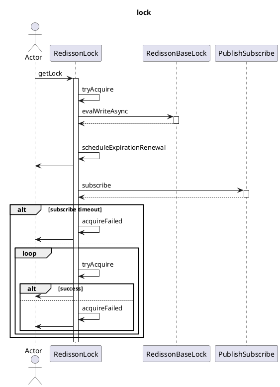
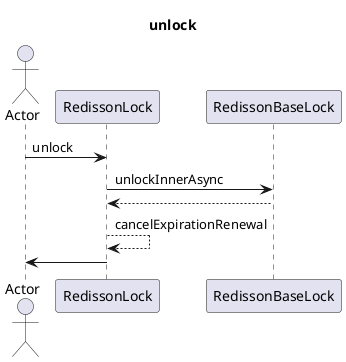

```plantuml
@startuml lock
title lock
actor Actor
Actor -> RedissonLock:getLock
activate RedissonLock
RedissonLock -> RedissonLock:tryAcquire
RedissonLock -> RedissonBaseLock:evalWriteAsync
activate RedissonBaseLock
RedissonBaseLock --> RedissonLock
deactivate RedissonBaseLock
alt success
    RedissonLock -> RedissonLock:scheduleExpirationRenewal
    RedissonLock -> Actor
else fail
    RedissonLock -> PublishSubscribe:subscribe
    activate PublishSubscribe
    PublishSubscribe --> RedissonLock
    deactivate
    alt subscribe timeout
        RedissonLock -> RedissonLock:acquireFailed
        RedissonLock -> Actor 
    else 
        loop 
            RedissonLock -> RedissonLock:tryAcquire
            alt success
                RedissonLock -> Actor
            else 
                RedissonLock -> RedissonLock:acquireFailed
                RedissonLock -> Actor
            end
    end
end
@enduml
```

```plantuml
@startuml 1
title unlock
actor Actor
Actor -> RedissonLock:unlock
RedissonLock -> RedissonBaseLock:unlockInnerAsync
RedissonBaseLock --> RedissonLock
RedissonLock --> RedissonLock:cancelExpirationRenewal
RedissonLock -> Actor
@enduml
```