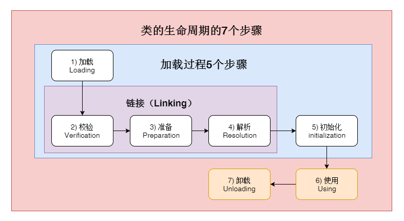
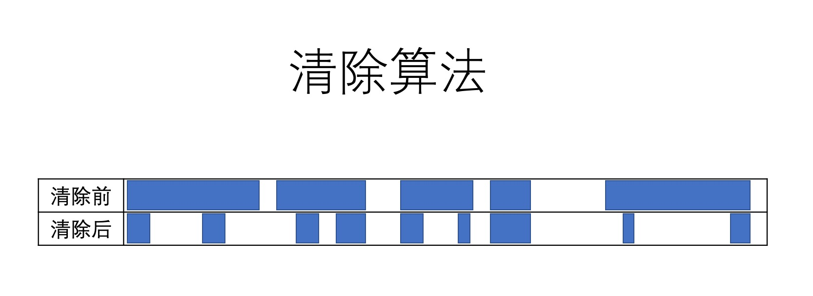
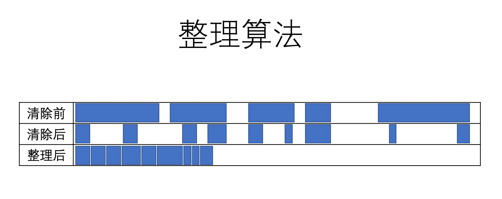
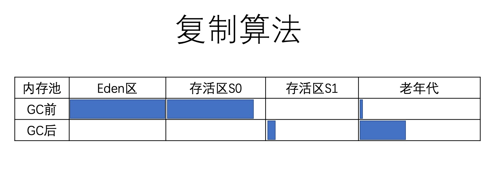
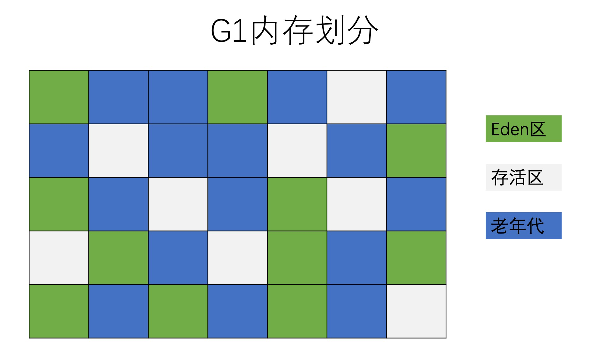
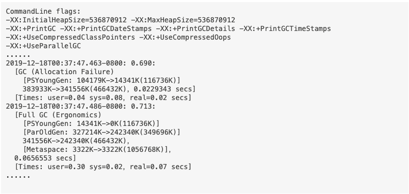

# JVM

## 环境

> JDK, JRE, JVM 的关系
>
> 就范围来说，JDK > JRE > JVM
> JDK = JRE + 开发工具
> JRE = JVM + 类库

## 字节码

> javac 和 javap 命令
> 常量池
> 方法体
> 非静态方法隐藏this参数
> 局部变量表
> JDK1.7 invokeDynamic 指令和 JDK8 lambda 表达式
> 通过字节码可以了解枚举类的实现

## 类加载

### 类的生命周期和加载过程

> 1. 加载：找到文件系统中的class文件，找不到报NoClassDefFoundError
> 2. 校验：校验class字节码的合法性
> 3. 准备：创建静态字段并赋默认值，如果静态字段被final修饰，则初始化
> 4. 解析：将符号引用解析成直接引用
> 5. 初始化：执行类构造器方法、静态变量赋值语句、静态代码块

> 用Class.forname动态加载类时，找不到class文件报ClassNotFoundException

## JMM

> 广义上包含
>
> 1. Java 内存结构
>
>> a. 堆（GC堆）：存储对象，数组。包括年轻代（Eden + S0 + S1），老年代
>> b. 栈：方法入参，局部变量
>> c. MetaSpace：方法区
>> d. CCS（compressed class space）：存类信息
>> e. code cache：存JIT编译后的本地代码
>>
>
> 2. 多线程环境下对共享变量操作，或者说并发编程规范（可见性、原子性、有序性）

### 内存屏障

> 四种屏障：LoadLoad, LoadStore, StoreStore, StoreLoad
> volatile 读，synchronized 进入：LoadLoad, LoadStore
> volatile 写，synchronized 退出：StoreLoad, StoreStore

## 启动命令 & 常见的JVM参数

> java [options] classname [args] 或者 java [options] -jar filename [args]
> options：JVM 参数，args：应用参数

> 1. -D： 指定环境变量
> 2. 以-开头： JVM 标准参数，向后兼容。例如：-server
> 3. 以-X开头：JVM 非标准参数，不保证向后兼容。例如：-Xmx
> 4. 以-XX:开头：非稳定参数。例如：-XX:NewSize=1m，-XX:+HeapDumpOnOutOfMemoryError
> 5. agent相关：-javaagent:jarpath
> 6. GC相关：-XX:+PrintGCDetails

## 内置命令行工具

> 1. jps：Java 进程
> 2. jstat：gc统计
> 3. jmap：内存信息
> 4. jstack：堆栈信息
> 5. jinfo：动态修改JVM参数

## GC（垃圾回收 & 垃圾回收算法）

> 初代垃圾收集器采用引用计数思想，不能解决循环引用问题
> 现代垃圾收集器基本上都是采用引用追踪（标记 - 清除）思想

> 分代回收：根据对象生命长短分为新生代和老年代
> 新对象内存分配逻辑：TLAB -> eden 共享区 -> GC -> Old（大对象）

> GC Root
> 局部变量
> 存活线程
> 静态变量
> JNI 引用
> 其他（跨代引用）

> 算法
>
> 1. 标记 - 清除：直接忽略所有的垃圾。也就是说在标记阶段完成后，所有不可达对象占用的内存空间，都被认为是空闲的，因此可以用来分配新对象。这种算法需要使用空闲表（free-list），来记录所有的空闲区域，以及每个区域的大小。维护空闲表增加了对象分配时的开销。此外还存在另一个弱点 —— 明明还有很多空闲内存，却可能没有一个区域的大小能够存放需要分配的对象，从而导致分配失败
>    
> 2. 标记 - 清除 - 整理：将所有被标记的对象（存活对象），迁移到内存空间的起始处，消除了“标记—清除算法”的缺点。相应的缺点就是 GC 暂停时间会增加，因为需要将所有对象复制到另一个地方，然后修改指向这些对象的引用。此算法的优势也很明显，碎片整理之后，分配新对象就很简单，只需要通过指针碰撞（pointer bumping）即可。使用这种算法，内存空间剩余的容量一直是清楚的，不会再导致内存碎片问题。
>    
> 3. 标记 - 复制：和“标记—整理算法”（Mark and Compact）十分相似：两者都会移动所有存活的对象。区别在于，“标记—复制算法”是将内存移动到另外一个空间：存活区。“标记—复制方法”的优点在于：标记和复制可以同时进行。缺点则是需要一个额外的内存区间，来存放所有的存活对象。
>    

> 垃圾收集器
>
> 1. Serial GC：只有一个GC线程，年轻代用mark-copy算法，老年代用mark-sweep-compact算法，适合小内存应用，暂停时间久

> 2. Parallel GC：使用 -XX:ParallelGCThreads 参数指定GC线程数量，默认值和CPU数量一致，算法和 Serial GC 一样，暂停时间比 Serial GC 短。Java8 默认实现

> JVM 会动态调整每个区的大小，可通过 -XX:+/-UseAdaptiveSizePolicy 控制，默认开启
> 调整策略
>
> 1. Young 和 Old 之间的调整：对象分配速率、晋升速率、回收效果
> 2. Eden 和 Survivor 之间的调整：存活率

> 3. CMS：年轻代用mark-copy算法，老年代用mark-sweep算法。CMS GC 的设计目标是避免在老年代垃圾收集时出现长时间的卡顿，主要通过两种手段来达成此目标：
>
>> 1. 不对老年代进行整理，而是使用空闲列表（free-lists）来管理内存空间的回收。
>> 2. 在 mark-and-sweep（标记—清除）阶段的大部分工作和应用线程一起并发执行。
>>
>>> 1. 初始标记（STW）
>>> 2. 并发标记
>>> 3. 并发预清理
>>> 4. 可取消的并发清理
>>> 5. 最终标记
>>> 6. 并发清除（STW）
>>> 7. 并发重置
>>>
>>

> 碎片是CMS最大的问题，某些情况下带来不可预估的暂停时间；CMS 复杂度高，和JVM耦合度高，维护成本大，在Java 9+ 已经废弃

> 4. G1： 不再分成固定的新生代和老年代，把堆划分成一个个小块，每个小块一会儿可以是eden区、存活区或者老年区，哪一块垃圾多就先清理哪一块。目标是把STW时间变的可控。
>    
>    重要的参数
>
>> 1. -XX:+UseG1GC ：启用 G1
>> 2. -XX:+InitiatingHeapOccupancyPercent ：决定什么情况下发生 G1 GC
>> 3. -XX:+MaxGCPauseMills ：期望每次 GC 暂定的时间
>>

> 5. ZGC：待补充

### Java 垃圾收集器对比（适用于 JDK8+）

| 收集器     | 年轻代算法      | 老年代算法 | 并发/并行        | 吞吐率 | 延迟控制 | 适用场景             | 特点                                               |
| ------------ | ----------------- | ------------ | ------------------ | -------- | ---------- | ---------------------- | ---------------------------------------------------- |
| Serial     | 复制算法        | 标记-压缩  | 否（单线程）     | 中     | 差       | 小堆、嵌入式场景     | 简单稳定，单线程，适合单核或资源受限环境           |
| Parallel   | 复制算法        | 标记-压缩  | 是（并行）       | 高     | 一般     | 吞吐优先、批处理任务 | 默认 GC（JDK8），追求吞吐，GC 停顿时间可能较长     |
| CMS        | 复制算法        | 标记-清除  | 是（老年代并发） | 中高   | 好       | Web 服务、响应要求高 | 已废弃，存在碎片问题，低延迟但需要更多 CPU 资源    |
| G1         | 区域化复制      | 区域化复制 | 是（并发标记）   | 高     | 可控     | 通用型推荐           | 替代 CMS，低碎片，用户可设定停顿目标，吞吐延迟均衡 |
| ZGC        | Region+颜色指针 | 同左       | 是（全并发）     | 中     | 极佳     | 大堆、低延迟应用     | JDK11+，<10ms 停顿时间，最大支持16TB堆，延迟极低   |
| Shenandoah | Region化        | 同左       | 是（全并发）     | 中     | 极佳     | 响应性要求极高场景   | JDK12+，红帽开发，低延迟，GC 与应用几乎并发执行    |

### GC 中的并行 Vs. 并发

> 1. 并行：多个GC 线程一起工作
> 2. 并发：业务线程和GC线程一起工作

### GC 日志

> 相关配置
>
> 1. -XX:+PrintGCDetails
> 2. -XX:loggc:/path/gc.log
> 3. -XX:+PrintGCDateStamps
> 4. -XX:+HeapDumpOnOutOfMemoryError

> 
> 解读
>
> 1. CommandLine flags 一行显示了内存、垃圾回收器等信息，可以看出使用了Parallel GC
> 2. 2019-12-18T00:37:47.463-0800: 0.690 表示距离JVM启动过去的时间，单位是秒
> 3. 104179K->14341K(116736K)：年轻代GC前、后、总的大小
> 4. 383933K->341556K(466432K)：整个堆GC前、后、总的大小
> 5. real=0.02 secs 应用程序实际暂停时间，约等于（user + sys）/ cup core

> 在线分析：[GCEasy]([https://gceasy.io/](https://gceasy.io/)https:/)
