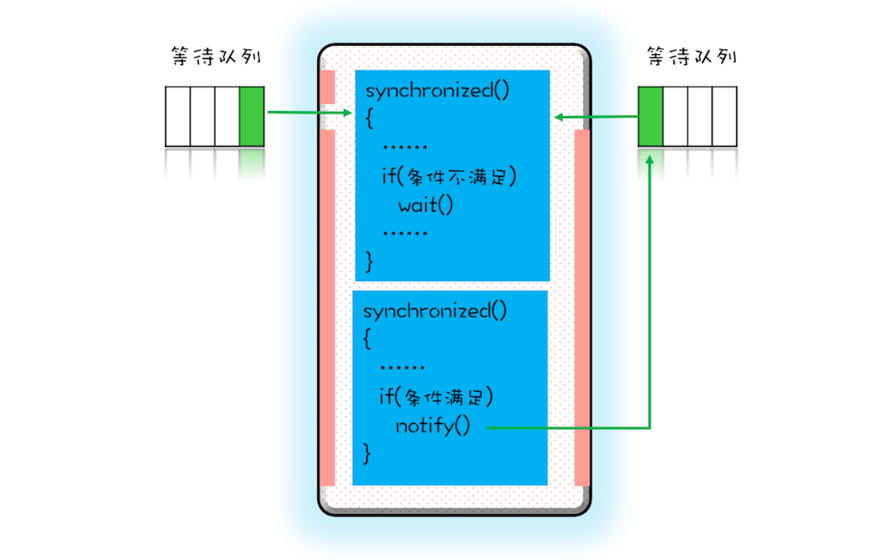
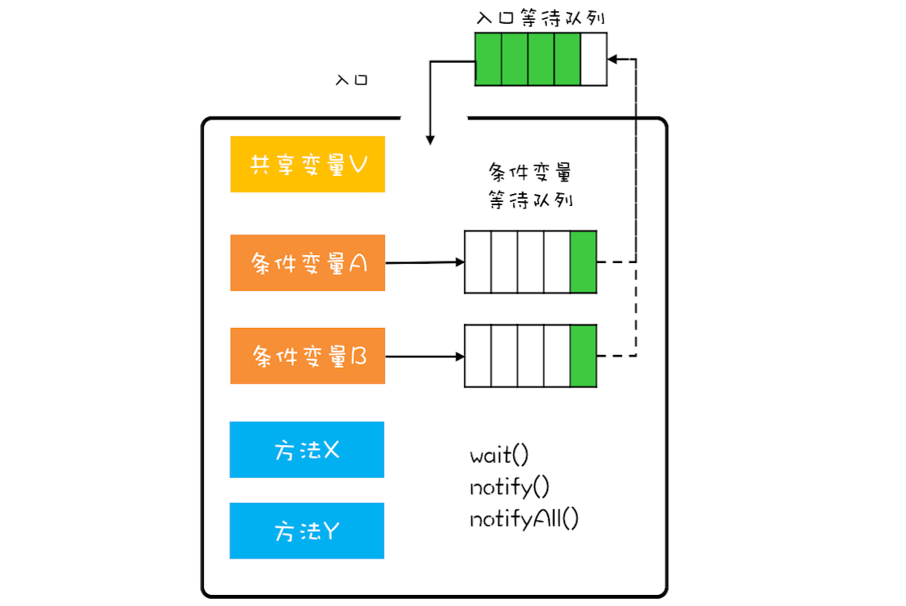
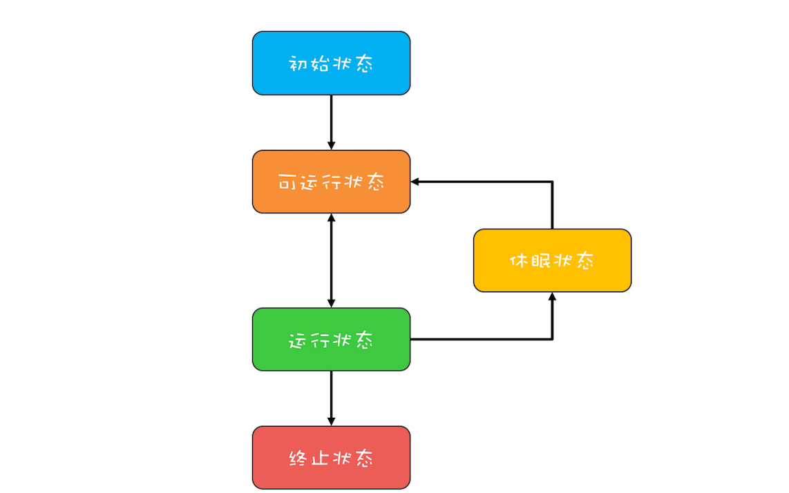
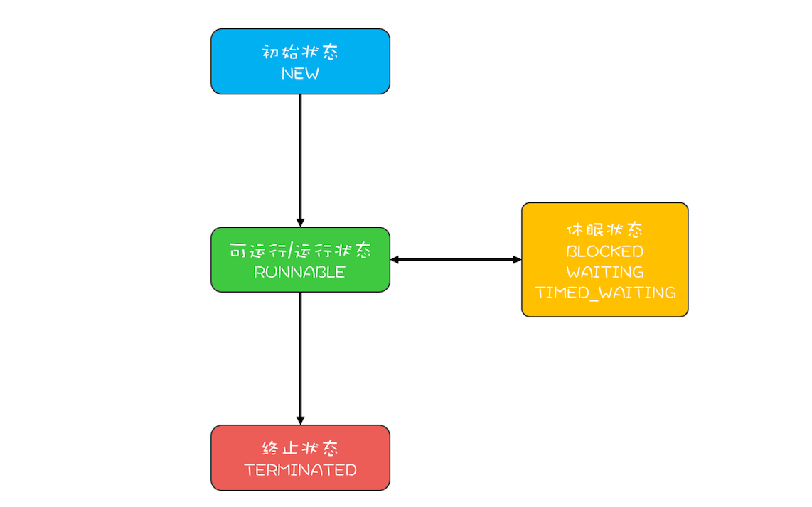
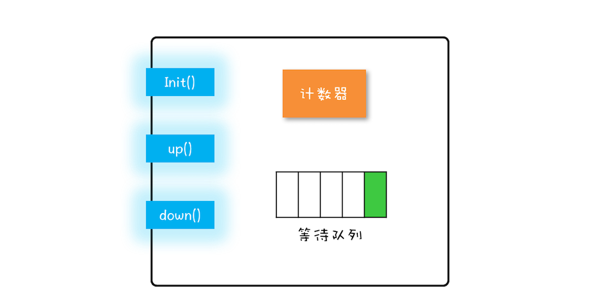
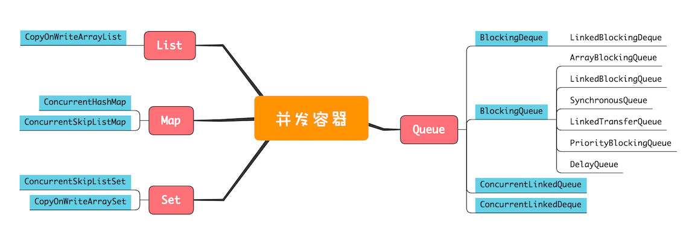
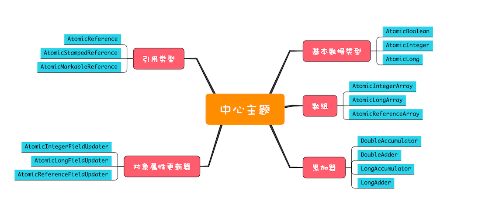

# 并发编程

> 可以抽象成三个问题：分工、同步、互斥
> 分工：把一个大任务分解成多个子任务。关注执行效率
> 同步：任务之间有依赖。当一个任务不满足执行条件时，需要等待，当任务满足执行条件时，需要被触发执行。关注执行效率
> 互斥：保证多个任务正确的访问同一个资源。关注的是（线程）安全

## 并发是为了提升性能

> 计算机体系结构（硬件）：CPU缓存，平衡CPU和内存的速度差异
> 操作系统（软件）：多进程、线程，分时复用CPU，平衡CPU和IO的速度差异
> 编译器（开发语言）：指令重排

> 解决问题的同时也引入了一些问题
> CPU缓存：可见性，一个线程对共享变量的修改，另一个线程能立刻看到
> 线程切换：原子性，多个操作（高级语言层面）不被中断
> 指令重排：有序性，程序按照代码的先后顺序执行

> 上面这些问题都可以归结为安全性问题
> 除此之外，还有活跃性、性能问题
> 活跃性问题：常见的有死锁、活锁、饥饿
> 性能问题：临界区是串行执行的，过多的串行执行会严重影响执行效率。相比单线程，用多核多线程能提升多少呢？可以用阿姆达尔（Amdahl）定律来表达，S = 1 / ((1 - p) + p/n), p代表并行百分比，n表示CPU核数。假设串行百分比为5%，则p = 95%，n -> ∞ 时，带来的最大提升是单核的20倍。

> [并发编程01](https://time.geekbang.org/column/article/83682)

## 如何解决可见性和有序性

> Java 内存规范了如何按需禁用缓存和编译优化的方法，包括volatile, synchronized, final关键字，6个Happens-Before原则。
> Java 内存模型：一套复杂的规范。从程序员角度看，关注并发编程相关部分，核心是Happens-Before原则。

> 6个Happens-Before原则（前一个操作的结果对后一个操作是可见的）
>
> 1. 程序的顺序性
> 2. volatile 规则: 对volatile变量的写操作，对后续的读操作可见
> 3. 传递性: 如果A Before B, B before C, 那么A Before C
> 4. 锁的规则：对 synchronized 的解锁 Before 于对 synchronized 的加锁
> 5. 线程 start() 方法：主线程A启动子线程B后，子线程能够看到启动前的操作
> 6. 线程 join() 方法：子线程的操作，对主线程调用子线程的join()方法后可见

## 如何解决原子性

> 互斥锁：synchronized
> 锁和被保护资源的关系：1:N，不能用多把锁来保护同一个资源

> 死锁条件和对应的解决方案
>
> 1. 互斥
> 2. 占用且等待：一次性申请所有资源
> 3. 不可抢占：占用部分资源的线程，进一步申请其他资源时申请不到，主动释放已占用的资源。
>> 1. 可响应中断：lock.lockInterruptibly()
>> 2. 支持超时：lock.tryLock(time, unit)
>> 3. 非阻塞：lock.tryLock()
> 4. 循环等待：按顺序申请资源


### 下面用并发转账这个例子来说明
```java

public class Account {
    private double balance;

    public Account(double balance) {
        this.balance = balance   
    }

    public void transfer(Account target, double amount) {
        this.balance -= amount;
        target.balance += amount;
    }
}


// 1. 用一把锁来锁定多个资源
public void transfer(...) {
    synchronized(Account.class) {
        ...
    }
}

// 2. 一次申请多个资源
public class Allocator {
    private List<Account> processing = new ArrayList<>();
  
    private static class Holder {
        private static final Allocator INSTANCE = new Allocator();
    }
  
    public Allocator getInstance() {
        return Holder.INSTANCE;
    }
  
    public synchronized boolean apply(Account from, Account to) {
        if (processing.contains(from) || processing.contains(to)) {
            return false;
        }
        processing.add(from);
        processing.add(to);
        return true;
    }
  
    public synchronized void release(Account from, Account to) {
        processing.remove(from);
        processing.remove(to);
    }
}

public class Account {
    private Allocator allocator = Allocator.getInstance();
  
    public void transfer(Account target, double amount) {
        while (!allocator.apply(this, target))
            ;
        
        try {
            // 再次加锁，保证balance可见性
            synchronized(this) {
                synchronized(target) {
                    ...
                }
            }
        } finally {
            allocator.release(this, target);
        }
    }
}

// 3. 按顺序申请资源
public class Account {
    private int id;

    public void transfer(...) {
        Account from = this;
        Account to = target;
        if (this.id > target.id) {
            from = target;
            to = this;
        }
        synchroized(from) {
            synchroized(to) {
                ...
            }
        }
    }
}

// 4. 主动释放锁
public class Account {
    private final Lock lock = new ReentrantLock();

    public Lock getLock() {
        return lock;
    }

    public void transfer(Account target, double money) {
        Random rand = new Random();
        boolean myLock = false;
        boolean targetLock = false;
        try {
            
            while (true) {
                myLock = lock.tryLock(10, TimeUnit.MILLISECONDS);
                targetLock = target.getLock().tryLock(10, TimeUnit.MILLISECONDS);
                
                if (myLock && targetLock) {
                    break;
                }

                if (myLock) {
                    lock.unlock();
                    myLock = false;
                }

                if (targetLock) {
                    target.getLock().unlock();
                    targetLock = false;
                }

                Thread.sleep(rand.nextInt(100));
            }
            ...
        } catch (InterruptedException e) {
            System.out.println("transfer had been interrupted");
        } finally {
            if (myLock) {
                lock.unlock();
            }
            if (targetLock) {
                target.getLock().unlock();
            }
        }
    }
}

```

##

## 通知 - 等待机制

> 上面的破坏“占用且等待”条件例子中，用到了while循环一直尝试获取锁，这样线程会一直占用CPU资源
> 使用 wait, notify, notifyAll 方法，在不满足条件时，线程挂起让出CPU，条件满足时唤醒等待线程

> 
> 流程解释
> 1. 获得锁的线程进入临界区，未获得锁的线程进入锁标记等待池，（左边的队列），管程中的入口等待队列
> 2. 条件不满足时，线程 wait 进入等待池（右边的队列），管程中的条件变量等待队列
> 3. notify 从等待池（右边队列）中随机唤醒一个线程，进入锁等待池（左边队列），重新争抢锁

```java
public synchronized void apply(Account from, Account to) {
    // wait 配合 while 使用，重新获得锁后需要再次检查条件
    while (processing.contains(from) || processing.contains(to)) {
        wait();
    }
    processing.add(from);
    processing.add(to);
}

public synchronized void release(Account from, Account to) {
    processing.remove(from);
    processing.remove(to);
    notifyAll();
}
```

### notify VS. notifyAll
> notify: 从等待队列里随机唤醒一个线程
> notifyAll: 唤醒所有等待线程

> 除非经过深思熟虑，否则尽量使用 notifyAll
> 什么时候使用 notify
> 1. 等待线程拥有相同的等待条件
> 2. 等待线程被唤醒后，执行相同的操作
> 3. 只需要唤醒一个线程

## 管程
> 并发编程领域历史悠久，相关的原理和技术纷繁复杂。管程就是一种可以很方便的解决并发问题的技术（规范）。
> 管程：英文Monitor，意译为管程，表示管理、操作共享变量的过程
> JDK1.5 之前，唯一的并发原语就是 synchronized，之后引入了JUC包
> 通过条件变量来实现线程之间的同步

### 管程模型
> 有 Hasen、Hoare、MSEA 三种实现模型，区别在当条件满足时，如何通知其他线程。Java使用的 MESA 模型
> 1. Hasen: 要求notify放在代码最后，通知后当前线程结束执行，被通知线程开始执行
> 2. Hoare: 通知后阻塞当前线程，被通知线程开始执行，执行完后再唤醒之前的线程。多了一个阻塞唤醒的过程
> 3. MESA: 通知后，当前线程继续执行，而被唤醒线程重新进入入口队列争抢锁。这样好处是notify没有固定的位置，也不用额外的阻塞唤醒操作，副作用是被唤醒线程拿到锁后需要再次检查执行条件，这也是为什么wait需要放在while循环里的原因。

> 
> 下面用一个例子：阻塞队列，来说明JUC包中管程的应用
``` java
public class BlockingQueue<T> {
    private int capacity;
    private List<T> list;
    private final ReentrantLock lock = new ReentrantLock();
    private final Condition noFull = lock.newCondition();
    private final Condition noEmpty = lock.newCondition();

    private void enqueue(T data) {
        lock.lock();
        try {
            while (list.size() >= capacity) {
                noFull.await();
            }
            list.add(T);
            noEmpty.signalAll();
        } finally {
            lock.unlock();
        }
    }

    private T dequeue() {
        lock.lock();
        try {
            while (list.size() == 0) {
                noEmpty.await();
            }
            T data = list.remove(0);
            noFull.signalAll();
            return data;
        } finally {
            lock.unlock();
        }
    }
}
```

## 通用的线程生命周期和 Java 线程生命周期

> 
> 通用的线程生命周期
> 初始状态：表示在编程语言层面创建线程对象，但在操作系统层面还没创建对应的物理线程
> 可运行状态：物理线程已经被创建，等待分配CPU
> 运行状态：分配到CPU资源
> 休眠状态：调用阻塞API或者等待某个事件，让出CPU
> 终止状态：正常结束或者抛出异常

> 
> Java 线程生命周期
> NEW 初始状态：同上
> RUNNABLE 可运行状态/运行状态：JVM把线程调度交给了操作系统，所以JVM把这两个状态合并了。在等待IO的场景下，物理线程是休眠状态，但是在JVM还是RUNNABLE
> BLOCKED/WAITING/TIMED_WAITING：JVM 把物理线程休眠状态按照引起的原因，细分成了三个
>> 1. BLOCKED: 等待synchronized锁
>> 2. WAITING: 调用 wait(), join() 等方法
>> 3. TIMED_WAITING: 调用 sleep(time), wait(time), join(time) 等带超时时间参数的方法。sleep 和 wait 的区别：sleep 不释放锁，wait 释放锁
> TERMINATED 终结状态：同上。通过调用 interrupt() 方法，也可以通知线程达到终止的目的。如果线程在WAITING，TIMED_WAITING状态，或者阻塞在nio方法上时，会主动抛出异常，否则需要手动调用 isInterrupted() 检查退出

### 线程数量
> 理论公式
> CPU 密集型：线程数 = CPU 数量 + 1（当线程因为偶尔的内存页失效或其他原因导致阻塞时，这个额外的线程可以顶上，从而保证 CPU 的利用率）
> IO 密集型：线程数 = CPU 数量 * (1 + IO操作耗时 / CPU操作耗时)

> 实际操作要围绕最大化资源（CPU， IO）利用率，结合监控数据不断作出调整

## JUC 包中的工具类

### Lock & Condition

### Semaphore

> 
> 信号量模型可以概括成：一个计数器，一个队列，三个方法。计数器和队列对使用者是透明的，可以通过三个方法来访问它们。
> 这三个方法分别是：init(), acquire(), release()
> acquire: 计数器减一，如果计数器的值大于等于0，继续执行
> release: 计数器加一，如果计数器的值小于等于0，唤醒等待队列中的一个线程

> 下面用 semaphore 来实现前面的阻塞队列
```java
public class BlockingQueue<T> {
    private List<T> list;
    private final Semaphore lock; // 临界区锁
    private final Semaphore spaces; // 空位数量
    private final Semaphore items; // 可用元素数量


    public BlockingQueue(int size) {
        list = new LinkedList<>(size);
        lock = new Semaphore(1);
        spaces = new Semaphore(size);
        items = new Semaphore(0);
    }

    public void enqueue(T data) {
        spaces.acquire();
        lock.acquire();
        try {
            list.add(data);
        } finally {
            lock.release();
            items.release();
        }
    }

    public T dequeue() {
        items.acquire();
        lock.acquire();
        try {
            return list.remove(0);
        } finally {
            lock.release();
            spaces.release();
        }
    }
}
```

### 读写锁 ReadWriteLock

> 基本原则
> 1. 读操作之间可并发
> 2. 读写操作互斥
> 3. 写操作互斥

> 实现读多写少场景的缓存
``` java
public class Cache<K, V> {
    private Map<K, V> cache = new HashMap<>();
    private final ReentrantReadWriteLock lock = new ReentrantReadWriteLock();
    private final Lock rlock = lock.readLock();
    private final Lock wlock = lock.writeLock();

    public V get(K key) {
        V v;
        rlock.lock();
        try {
            v = cache.get(key);
        } finally {
            rlock.unlock();
        }
        if (v != null) {
            return v;
        }
        wlock.lock(); // 不支持锁升级，先释放读锁，再获取写锁；但是锁降级是允许的
        try {
            v = cache.get(key);
            if (v == null) {
                v = getFromDB();
                cache.put(key, v);
            }
            return v;
        } finally {
            wlock.unlock();
        }
    }

    public put(K key, V value) {
        wlock.lock();
        try {
            cache.put(key, value)
        } finally {
            wlock.unlock();
        }
    }
}
```

### 高性能读写锁 StampedLock

使用范式
```java
final StampedLock lock = new StampedLock();

// 乐观读
long stamp = lock.tryOptimisticRead();
if (!lock.valid(stamp)) {
    stamp = lock.readLock();
    try {
        // 读入局部变量
    } finally {
        lock.unlockRead(stamp);
    }
}
// 立马操作局部变量

// 写锁
long stamp = lock.writeLock();
try {

} finally {
    lock.unlockWrite(stamp);
}
```

#### ReentReadWriteLock VS. StampedLock
| 特性                     | ReentrantReadWriteLock          | StampedLock                             |
|--------------------------|----------------------------------|------------------------------------------|
| 可重入性                 | ✅ 是（支持同线程重复加锁）     | ❌ 否（不可重入，重复加锁会死锁）       |
| 乐观读支持               | ❌ 无                            | ✅ 有（`tryOptimisticRead` + `validate`）|
| 读锁是否阻塞写锁         | ✅ 是（读锁会阻塞写锁）          | ✅ 是                                    |
| 写锁是否阻塞读锁         | ✅ 是                            | ✅ 是                                    |
| 适合读多写少场景         | ✅ 一般                          | ✅✅ 更加优化                            |
| 性能（高并发下）         | 中等                             | 更高，尤其是读多写少                     |
| 锁释放方式               | 使用 unlock()                    | 使用 `unlockRead(stamp)` / `unlockWrite(stamp)` |
| 条件变量（Condition）    | ✅ 支持                          | ❌ 不支持                                |
| 实现复杂度               | 简单易用                         | 较复杂，需要注意 stamp 管理             |
| 适合的使用场景           | 一般并发读写                     | 高性能读优化、非阻塞读、地理位置数据等   |
| 错误使用后果             | 可能抛异常                       | stamp 错误解锁会导致死锁或数据问题       |

### CountDownLatch & CyclicBarrier

> CountDownLatch 用在一个线程等待其他多个线程的场景
> CyclicBarrier 用在线程之间互相等待的场景，除此之外，它的计数器是可以循环利用的，还可以设置回调函数

> CountDownLatch 简单实现
```java
class CountDownLatch {
    private int count;
    private final ReentrantLock lock = new ReentrantLock();
    private final Condition zero = lock.newCondition();

    public CountDownLatch(int count) {
        this.count = count;
    }

    public void countDown() {
        lock.lock();
        try {
            count -= 1;
            zero.signal();
        } finally {
            lock.unlock();
        }
    }

    public void await() throws InterruptedException {
        lock.lock();
        try {
            while (count != 0) {
                zero.await();
            }
        } finally {
            lock.unlock();
        }
    }

    public boolean await(Long time, TimeUnit timeUnit) throws InterruptedException {
        long end = System.currentTimeMillis() + timeUnit.toMillis(time);
        lock.lock();
        try {
            while (count != 0) {
                if (!zero.await(end - System.currentTimeMillis(), TimeUnit.MILLISECONDS)) {
                    return true;
                }
            }
            return false;
        } finally {
            lock.unlock();
        }
    }
}
```

> CyclicBarrier 简单实现
```java
public class CyclicBarrier {
    private int total;
    private int count;

    private Generation generation = new Generation();
    private final ReentrantLock lock = new ReentrantLock();
    private final Condition zero = lock.newCondition();

    private static class Generation {

    }
    public CyclicBarrier(int count) {
        this.total = count;
        this.count = count;
    }


    public void await() throws InterruptedException {
        lock.lock();
        try {
            final Generation gen = generation;

            --count;

            if (count == 0) {
                count = total;
                generation = new Generation();
                zero.signalAll();
                return;
            }

            do {
                zero.await();
            } while (gen == generation);

        } finally {
            lock.unlock();
        }
    }
}
```

### 线程安全容器

> 四种容器：List，Map，Set，Queue/Deque
> 在 JDK1.5 以及之前，通过 Collections的synchronizedList，synchronizedSet，synchronizedMap 方法包装，或者使用Vector、HashTable
> 并发容器
> 


### 原子类
> 

### 异步编程 CompletionFuture

> 应用场景：任务之间有依赖关系：串行、AND汇聚、OR汇聚

> 注意点
> 1. 任务默认提交到 ForkJoinPool 线程池执行，这个线程池核心线程数等于CPU核数。如果是IO密集型任务，一定要用自定义线程池
> 2. 异常处理


### 批量并行任务 CompletionService

> 生产者 - 消费者模式

### 分而治之 Fork/Join 任务

> 实现异步版本的归并排序
```java
    class MergeSort extends RecursiveTask<List<Integer>> {
        private List<Integer> list;

        public MergeSort(List<Integer> list) {
            this.list = list;
        }

        @Override
        protected List<Integer> compute() {
            if (list.size() <= 1) {
                return list;
            }

            int mid = list.size() / 2;
            List<Integer> l1 = list.subList(0, mid);
            List<Integer> l2 = list.subList(mid, list.size());
            MergeSort t1 = new MergeSort(l1);
            MergeSort t2 = new MergeSort(l2);
            // 做法1
            invokeAll(t1, t2);
            List<Integer> r1 = t1.join();
            List<Integer> r2 = t2.join();
            return merge(r1, r2);
            // 做法2
            t2.fork();
            return merge(t1.compute(), t2.join())
        }

        private List<Integer> merge(List<Integer> r1, List<Integer> r2) {
            List<Integer> result = new ArrayList<>(r1.size() + r2.size());
            int m = 0, n = 0;
            while (m < r1.size() && n < r2.size()) {
                if (r1.get(m) <= r2.get(n)) {
                    result.add(r1.get(m++));
                } else {
                    result.add(r2.get(n++));
                }
            }
            if (m < r1.size()) {
                for (int i = m; i < r1.size(); i++) {
                    result.add((r1.get(i)));
                }
            } else {
                for (int i = n; i < r2.size(); i++) {
                    result.add((r2.get(i)));
                }
            }
            return result;
        }
    }
```

## 并发设计模式

### 避免共享
#### Immutability 模式
> String、基本类型包装类、AtomicReference对象
> 用享元模式创建不可变对象，不可以用作对象锁

#### CopyOnWrite 模式
> 读性能要求高、读多写少、弱一致性

#### ThreadLocal 模式
> 跨线程传递上下文需要用InheritableThreadLocal，传递到线程池要用 [TransmittableTreadLocal](https://github.com/alibaba/transmittable-thread-local?tab=readme-ov-file)

## 多线程版本的if
#### Guarded Suspension 模式
> 管程

#### Balking 模式
> 条件不满足直接退出

### 分工模式
#### Thread-Per-Message 模式
> 每次新建一个线程
> 协程/用户级线程，JDK21 正式发布 LOOM

#### Worker Thread 模式
> 线程池

#### 生产者-消费者模式

### 线程两阶段终止模式


## 实战

### NIO / Reactor 模型

> 以 Tomcat 为研究对象
> 采用了多Reactor多线程模型，Acceptor 负责接收链接，Poller 负责监听读写准备就绪的链接，之后交给 Worker 线程处理业务逻辑
> 最大 Socket 链接数由参数 maxConnections 控制，达到最大链接数量后，放入 OS backlog 队列，队列参数由 acceptCount 控制
> 最大并行处理请求数量由 maxThreads 控制，maxConnections 是最多放多少个请求进来，maxTreads 是同时最多处理多少个请求

### STM （software transactional memory）

> 模拟实现数据库的事务的ACID特性中的ACI。
> 每个事务都有唯一的txnID，更新数据值时会把txnID一并更新到数据的事务ID属性
> 更新时，如果数据的txnID变了（当前值不等于一开始读到的值），则自旋检查

```java
public final class VersionRef<T> {
    private final T value;
    private final Long version;

    public VersionRef(T value, Long version) {
        this.value = value;
        this.version = version;
    }

    public T getValue() {
        return value;
    }

    public Long getVersion() {
        return version;
    }
}

public interface Txn {
    <T> T get(TxnRef<T> ref);

    <T> void set(TxnRef<T> ref, T value);
}

public class TxnRef<T> {
    private volatile VersionRef<T> cur;

    public TxnRef(T value) {
        this.cur = new VersionRef<>(value, 0L);
    }

    public VersionRef<T> getCur() {
        return cur;
    }

    public void setCur(VersionRef<T> cur) {
        this.cur = cur;
    }

    public T get(Txn txn) {
        return txn.get(this);
    }

    public void set(Txn txn, T value) {
        txn.set(this, value);
    }
}

public class STMTxn implements Txn {
    private static AtomicLong txnSeq = new AtomicLong(0);

    private Map<TxnRef, VersionRef> inTxnMap = new HashMap<>();
    private Map<TxnRef, Object> writeMap = new HashMap<>();

    private final Long txnId;
    public STMTxn() {
        txnId = txnSeq.incrementAndGet();
    }

    @Override
    public <T> T get(TxnRef<T> ref) {
        if (!inTxnMap.containsKey(ref)) {
            inTxnMap.put(ref, ref.getCur());
        }
        return (T) inTxnMap.get(ref).getValue();
    }

    @Override
    public <T> void set(TxnRef<T> ref, T value) {
        if (!inTxnMap.containsKey(ref)) {
            inTxnMap.put(ref, ref.getCur());
        }
        writeMap.put(ref, value);
    }

    public boolean commit() {
        synchronized(STM.commitLock) {
            boolean isValid = true;
            for (Map.Entry<TxnRef, VersionRef> entry : inTxnMap.entrySet()) {
                if (entry.getKey().getCur().getVersion() != entry.getValue().getVersion()) {
                    isValid = false;
                    break;
                }
            }

            if (isValid) {
                writeMap.forEach((k, v) -> {
                    k.setCur(new VersionRef(v, txnId));
                });
            }

            return isValid;
        }
    }
}

public interface TxnRunnable {
    public void run(Txn txn);
}

public class STM {
    public final static Object commitLock = new Object();

    public static void atomic(TxnRunnable run) {
        while (true) {
            STMTxn txn = new STMTxn();
            run.run(txn);
            if (txn.commit()) {
                break;
            }
        }
    }
}

public class TxnAccount {
    private final TxnRef<Long> balance;

    public TxnAccount(Long balance) {
        this.balance = new TxnRef<>(balance);
    }

    public TxnRef<Long> getBalance() {
        return balance;
    }

    public void transfer(TxnAccount target, Long amount) {
        STM.atomic(txn -> {
            Long from = balance.get(txn);
            if (amount <= from) {
                balance.set(txn, from - amount);
                Long to = target.balance.get(txn);
                target.balance.set(txn, to + amount);
            }
        });
    }
}
```