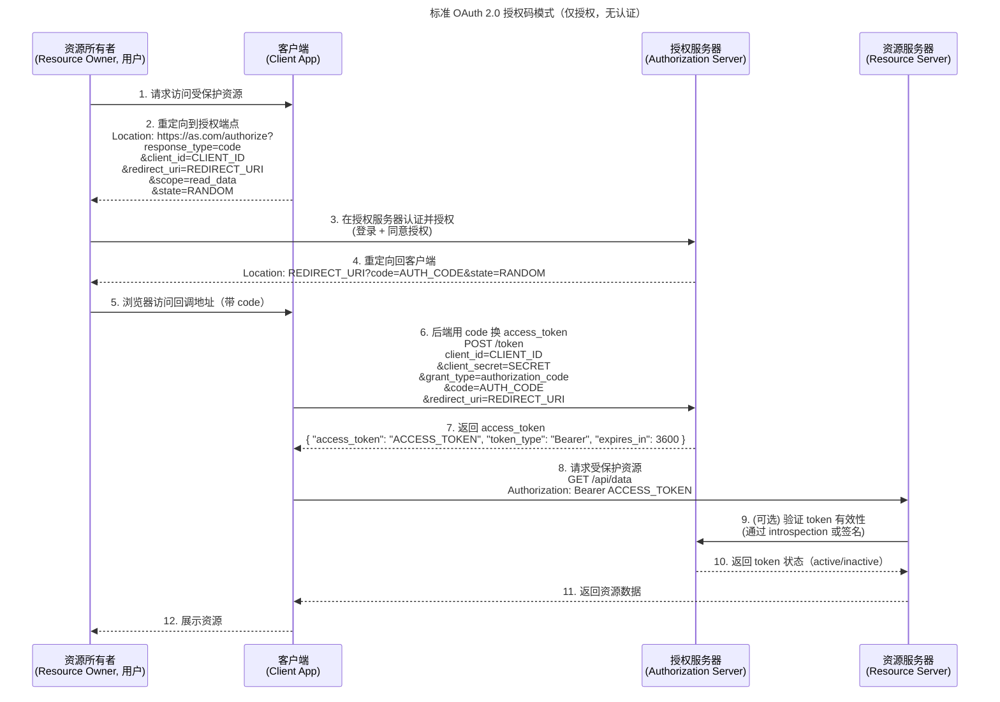
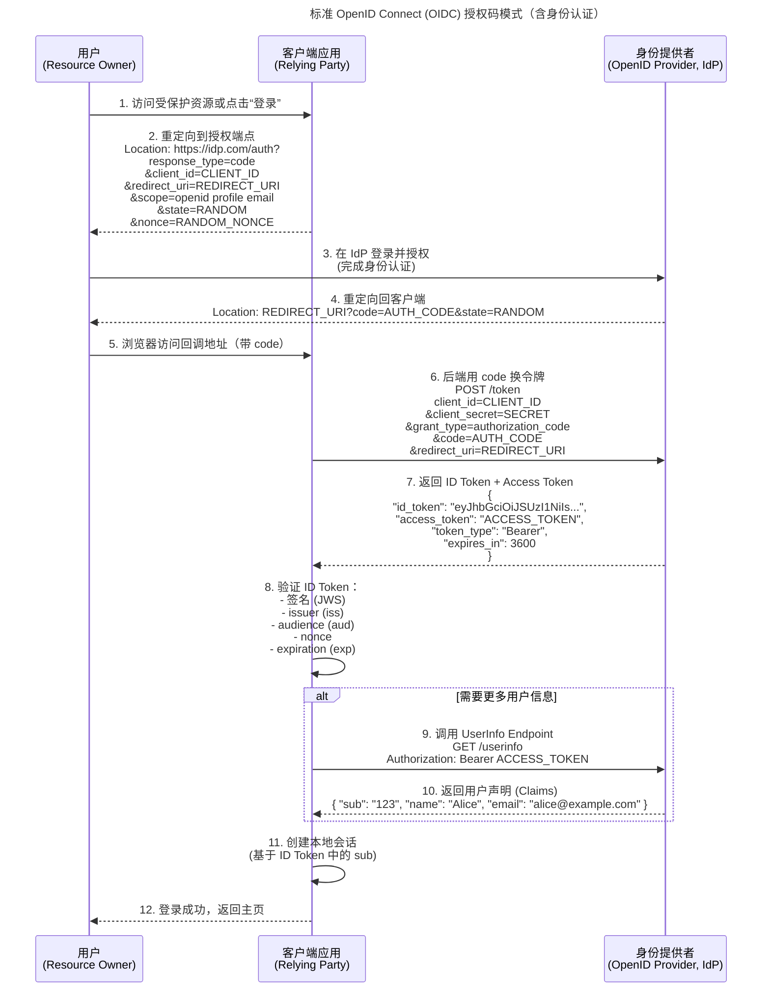
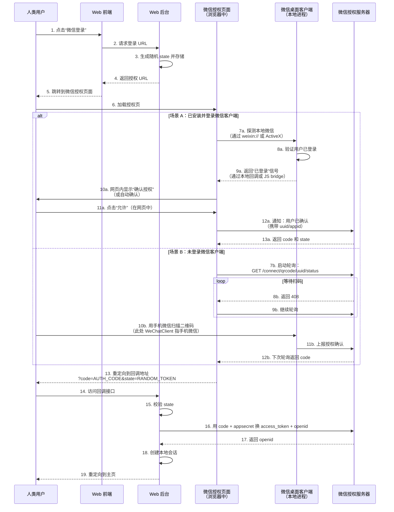

# 认证

## SSO (Single Sign On)

### OAuth2.0

### OIDC (Open ID Connect)

**OAuth2.0 VS. OIDC**
> 💡 一句话总结：
OIDC = OAuth 2.0 + 标准化身份认证层。
所有 OIDC 实现都兼容 OAuth 2.0，但 OAuth 2.0 本身不能安全实现“登录”功能。

| 对比维度 | OAuth 2.0 | OpenID Connect (OIDC) |
|---------|-----------|------------------------|
| **核心目的** | **授权（Authorization）** “你能访问什么资源？” | **身份认证（Authentication）** “你是谁？” |
| **标准规范** | [RFC 6749](https://datatracker.ietf.org/doc/html/rfc6749) | [OpenID Connect Core 1.0](https://openid.net/specs/openid-connect-core-1_0.html)（基于 OAuth 2.0） |
| **是否包含认证** | ❌ 否（仅授权） | ✅ 是（在授权基础上增加认证） |
| **关键令牌** | `access_token`（用于访问资源） | `id_token`（JWT 格式，用于身份认证） `access_token`（可选，用于访问 UserInfo） |
| **用户身份标识** | 无标准字段；依赖平台私有接口（如微信 `openid`） | ✅ 标准化 `sub`（Subject）声明，全局唯一用户 ID |
| **必需 Scope** | 自定义（如 `read:data`） | 必须包含 `openid` |
| **防重放机制** | 无 | ✅ `nonce` 参数（绑定 ID Token 到当前会话） |
| **用户信息获取** | 无标准方式；需调用平台私有 API | ✅ 标准化 `/userinfo` 端点（返回 JSON Claims） |
| **令牌验证** | 资源服务器验证 `access_token`（如 introspection 或 JWT 签名） | 客户端直接验证 `id_token` 签名及声明（无需网络请求） |
| **典型用例** | - 第三方 App 访问 Google Drive - 后台服务调用 API | - “使用 Google 账号登录” - 企业单点登录（SSO） |
| **是否支持 SSO** | ❌ 无法安全实现用户登录 | ✅ 是现代 SSO 的标准协议 |
| **标准化程度** | 授权框架，但身份部分无标准 | 高度标准化，跨平台互操作性强 |
| **代表平台** | 微信、微博、GitHub（仅 OAuth 模式） | Google、Microsoft Entra ID、Auth0、Okta、Keycloak |

**微信扫码登录流程**
> 基于 OAuth 2.0 的授权码模式 实现的 身份认证（Authentication），但它 不是 OpenID Connect（OIDC），而是**微信平台的私有认证扩展。因此，这个时序图只包含 OAuth 2.0 + 微信自定义的身份认证逻辑，并未使用 OIDC。
