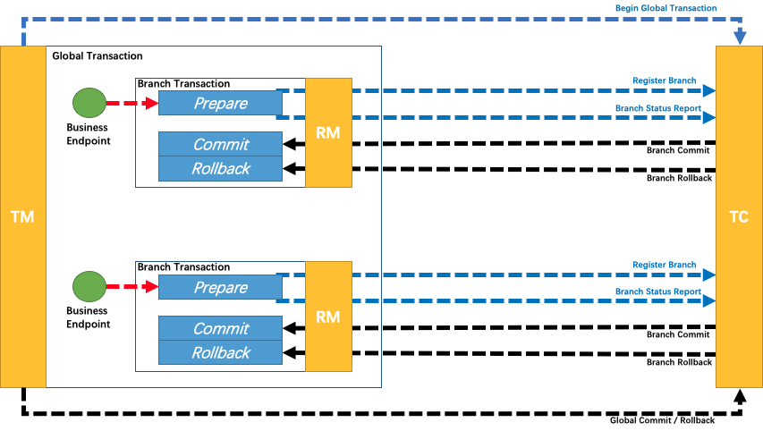
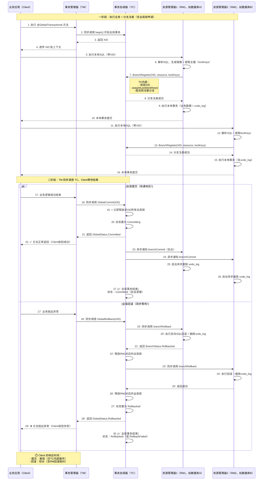
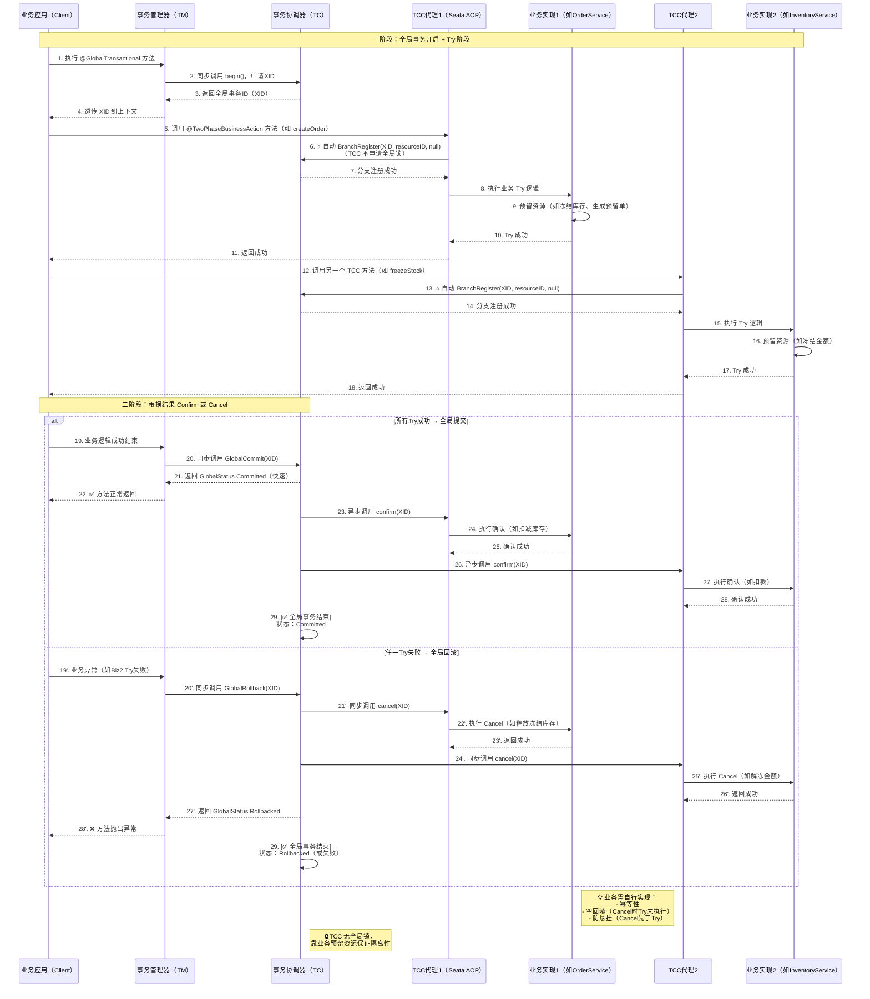

# SEATA

## 分布式事务

> 分布式服务背景下，一个完整的业务逻辑通常需要由几个服务共同完成。比如电商中的下单场景，涉及库存、订单、账户等服务，这些服务之间的数据，也需要像普通事务一样，保持ACID特性。跨服务的事务，是其中一种分布式事务，其他的，像跨异构数据源，例如库存数据同时保存在 Mysql 和 Redis 中，它们之间也需要保证数据一致性，也是一种分布式事务。
>
> SEATA 是阿里巴巴开源的一款支持分布式事务的框架，是我们学习分布式事务的一个不错的选择

## 核心术语

> seata server: 扮演事务协调者（TC: Transaction Coordinator）的角色，负责维护全局事务状态，管理分支事务，协调全局事务提交/回滚
> seata client: 分布式事务参与者，一般是业务应用服务。内部集成分布式事务管理器（TM: Transaction Manager）和资源管理器（RM: Resource Manager），分别负责开启/提交/回滚全局事务，和数据库交互

## 事务模式

> 基于两阶段提交模型

### AT

> 基于支持本地 ACID 事务的关系型数据库。特点是低业务入侵，数据强一致性。由于 RM 需要解析业务 SQL 生成 undo log，一定程度上会影响性能，所以要求业务 SQL 尽量简单。
> 全局事务隔离级别是读未提交

**整体机制**

> 一阶段：注册分支、获取全局锁，提交 undo log 和业务sql
> 二阶段：异步commit，删除 undo log；通过 undo log 回滚

**流程图**

### TCC

> 属于在服务层实现全局事务，不依赖具体的事务资源（数据库），但需要业务实现具体的 try-confirm-cancel 方法。特点是高业务入侵，数据强一致性，高性能。常见的跨资源 Redis / 消息队列 / Mysql 场景下可以使用该模式

**流程图**

### SAGA

### XA