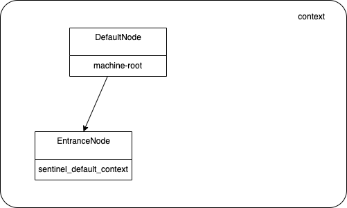
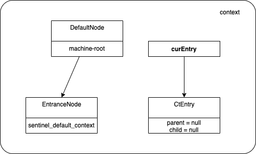
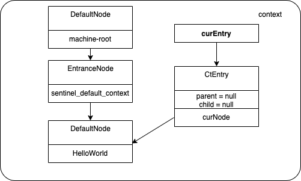

# Sentinel

> Sentinel 以流量为切入点，为分布式架构服务提供流量控制、熔断降级等功能

## 核心概念
### 资源
资源是 Sentinel 的关键概念。它可以是 Java 应用程序中的任何内容，例如，由应用程序提供的服务，或由应用程序调用的其它应用提供的服务，甚至可以是一段代码。在接下来的文档中，我们都会用资源来描述代码块。
只要通过 Sentinel API 定义的代码，就是资源，能够被 Sentinel 保护起来。大部分情况下，可以使用方法签名，URL，甚至服务名称作为资源名来标示资源。

### 规则
围绕资源的实时状态设定的规则，可以包括流量控制规则、熔断降级规则以及系统保护规则。所有规则可以动态实时调整。

## 核心功能
### 流量控制
服务需要处理的请求是不可预估的，随时面临着被大流量请求压垮的风险。因此需要根据系统处理能力，在流量入口处重新对流量整形，控制好流量

### 熔断降级
分布式系统存在调用链路，一个不稳定的服务可能会导致整个链路上的服务不可用。因此需要对不稳定的服务做熔断处理，让调用这个服务的请求做快速失败处理


## 快速入门
```java
public static void main(String[] args) {
    // 配置规则.
    initFlowRules();

    while (true) {
        // 1.5.0 版本开始可以直接利用 try-with-resources 特性
        try (Entry entry = SphU.entry("HelloWorld")) {
            // 被保护的逻辑
            System.out.println("hello world");
        } catch (BlockException ex) {
                // 处理被流控的逻辑
            System.out.println("blocked!");
        }
    }

    private static void initFlowRules(){
        List<FlowRule> rules = new ArrayList<>();
        FlowRule rule = new FlowRule();
        rule.setResource("HelloWorld");
        rule.setGrade(RuleConstant.FLOW_GRADE_QPS);
        // Set limit QPS to 20.
        rule.setCount(20);
        rules.add(rule);
        FlowRuleManager.loadRules(rules);
    }
}
```

## 工作原理
先来看下几个核心类

- 描述数据之间的关系以及存放数据的类有：Context、Entry、Node
- 实现限流、降级等功能的类有：ProcessSlot 各实现类，这其中又分为两大类
    - 构建数据关系和统计数据：NodeSelectorSlot（调用链路构建）、ClusterBuilderSlot（统计簇点构建）、StatisticSlot（监控统计）
    - 判断规则：FlowSlot（流量控制）、DegradeSlot（熔断降级）


### Context
> Context 代表调用链路上下文，贯穿一次调用链路中的所有 Entry。Context 维持着入口节点（entranceNode）、本次调用链路的 curNode、调用来源（origin）等信息。Context 名称即为调用链路入口名称。

> Context 维持的方式：通过 ThreadLocal 传递，只有在入口 enter 的时候生效。由于 Context 是通过 ThreadLocal 传递的，因此对于异步调用链路，线程切换的时候会丢掉 Context，因此需要手动通过 ContextUtil.runOnContext(context, f) 来变换 context。

### Entry
>每一次资源调用都会创建一个 Entry。Entry 包含了资源名、curNode（当前统计节点）、originNode（来源统计节点）等信息。

>CtEntry 为普通的 Entry，在调用 SphU.entry(xxx) 的时候创建。特性：Linked entry within current context（内部维护着 parent 和 child）

>需要注意的一点：CtEntry 构造函数中会做调用链的变换，即将当前 Entry 接到传入 Context 的调用链路上（setUpEntryFor）。

>资源调用结束时需要 entry.exit()。exit 操作会过一遍 slot chain exit，恢复调用栈，exit context 然后清空 entry 中的 context 防止重复调用。

### Node
Sentinel 里面的各种种类的统计节点：

- StatisticNode：最为基础的统计节点，包含秒级和分钟级两个滑动窗口结构。
- DefaultNode：链路节点，用于统计调用链路上某个资源的数据，维持树状结构。
- ClusterNode：簇点，用于统计每个资源全局的数据（不区分调用链路），以及存放该资源的按来源区分的调用数据（类型为 StatisticNode）。特别地，Constants.ENTRY_NODE 节点用于统计全局的入口资源数据。
- EntranceNode：入口节点，特殊的链路节点，对应某个 Context 入口的所有调用数据。Constants.ROOT 节点也是入口节点。

构建的时机：

- EntranceNode 在 ContextUtil.enter(xxx) 的时候就创建了，然后塞到 Context 里面。
- NodeSelectorSlot：根据 context 创建 DefaultNode，然后 set curNode to context。
- ClusterBuilderSlot：首先根据 resourceName 创建 ClusterNode，并且 set clusterNode to defaultNode；然后再根据 origin 创建来源节点（类型为 StatisticNode），并且 set originNode to curEntry。

几种 Node 的维度（数目）：

- ClusterNode 的维度是 resource
- DefaultNode 的维度是 resource * context，存在每个 NodeSelectorSlot 的 map 里面
- EntranceNode 的维度是 context，存在 ContextUtil 类的 contextNameNodeMap 里面
- 来源节点（类型为 StatisticNode）的维度是 resource * origin，存在每个 ClusterNode 的 originCountMap 里面

### ProcessorSlot

> Sentinel 实现各种功能的单元抽象成 Slot，主要实现有 ProcessSlotChain

### ProcessorSlotChain
> Sentinel 的核心骨架，将不同的 Slot 按照顺序串在一起（责任链模式），从而将不同的功能（限流、降级、系统保护）组合在一起。slot chain 其实可以分为两部分：统计数据构建部分（statistic）和判断部分（rule checking）。核心结构：

目前的设计是 one slot chain per resource，因为某些 slot 是 per resource 的（比如 NodeSelectorSlot）。

### StatisticSlot
> StatisticSlot 是 Sentinel 最为重要的类之一，用于根据规则判断结果进行相应的统计操作。

> entry 的时候：依次执行后面的判断 slot。每个 slot 触发流控的话会抛出异常（BlockException 的子类）。若有 BlockException 抛出，则记录 block 数据；若无异常抛出则算作可通过（pass），记录 pass 数据。

> exit 的时候：若无 error（无论是业务异常还是流控异常），记录 complete（success）以及 RT，线程数-1。

> 记录数据的维度：线程数+1、记录当前 DefaultNode 数据、记录对应的 originNode 数据（若存在 origin）、累计 IN 统计数据（若流量类型为 IN）。


## 源码解析（version = 1.8.2）

1. 创建 context：



2. 创建第一个 entry：



3. 进入 slotChain，处理顺序为：solt_1.entry -> solt_1.fireEntry -> solt_2.entry -> solt_2.fireEntry -> ...

4. 进入 NodeSelectorSlot


离开 slotChain，处理顺序为：

```java
/**
* 使用 SphU（实现类为 CtSphU）定义名为 HelloWorld 的资源，并且获取资源
*/
Entry entry = SphU.entry("HelloWorld")

public Entry entry(String name, EntryType type, int count, Object... args) throws BlockException {
    /**
        * 使用 StringResourceWrapper 类定义资源，StringResourceWrapper 继承了 ResourceWrapper 类，其重写了 hashcode 和 equals 方法，name是资源的唯一标识
    */
    StringResourceWrapper resource = new StringResourceWrapper(name, type);
    return entry(resource, count, args);
}


private Entry entryWithPriority(ResourceWrapper resourceWrapper, int count, boolean prioritized, Object... args)
    throws BlockException {
    // context 保存在 ThreadLocal 中
    Context context = ContextUtil.getContext();

    if (context == null) {
        // Using default context.
        context = InternalContextUtil.internalEnter(Constants.CONTEXT_DEFAULT_NAME);
    }

    // AbstractLinkedProcessorSlot -> NodeSelectorSlot -> ClusterBuilderSlot -> LogSlot -> StatisticSlot -> AuthoritySlot -> SystemSlot -> ParamFlowSlot -> FlowSlot -> DegradeSlot
    ProcessorSlot<Object> chain = lookProcessChain(resourceWrapper);

    Entry e = new CtEntry(resourceWrapper, chain, context);
    try {
        chain.entry(context, resourceWrapper, null, count, prioritized, args);
    } catch (BlockException e1) {
        e.exit(count, args);
        throw e1;
    } catch (Throwable e1) {
        // This should not happen, unless there are errors existing in Sentinel internal.
        RecordLog.info("Sentinel unexpected exception", e1);
    }
    return e;
}
```