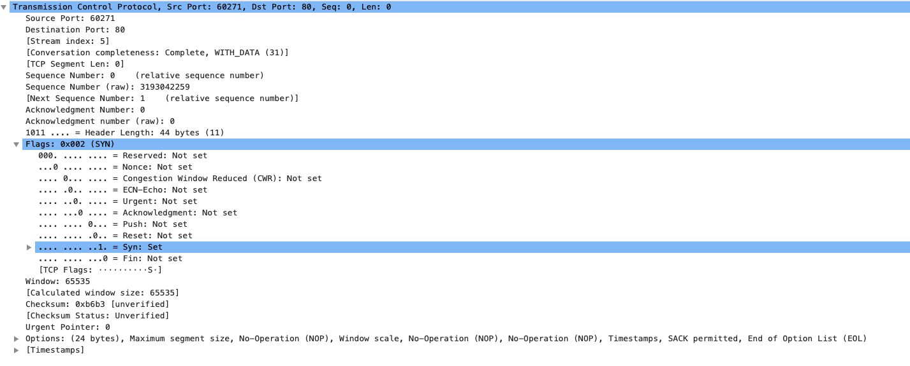
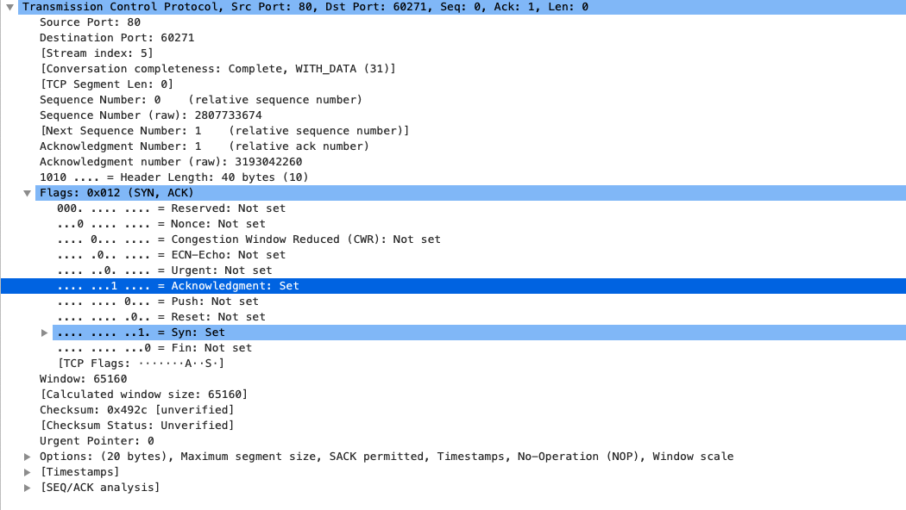
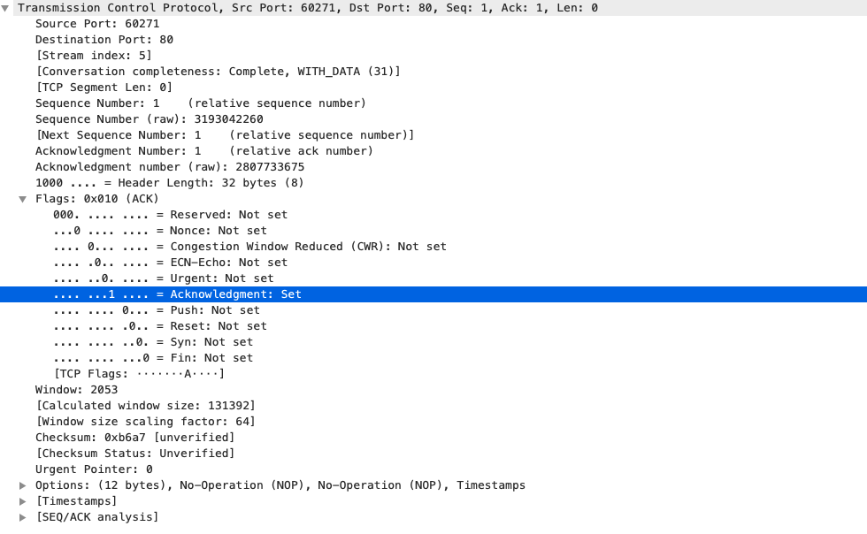
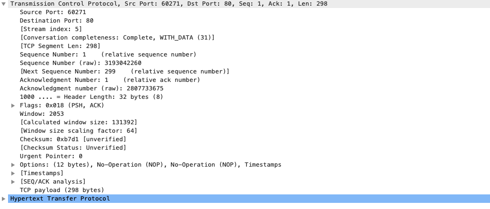

# TCP

## 定义
全称 Transmission Control Protocol，中文翻译为传输控制协议，一种面向链接，可靠的传输协议

## 包头格式

> 序号：

> 确认序号：

> 状态位  
> 1. URG:
> 2. ACK:
> 3. PSH:
> 3. RST:
> 4. SYN:
> 5. FIN:

## 三次握手
> 为什么是三次

> 状态时序图

> 过程详解

> 第一次握手，SYN = 1，seq=3193042259

> 第二次握手，SYN, ACK = 1，seq=2807733674，ack=3193042260

> 第三次握手，ACK = 1，seq=3193042260，ack=2807733675

## 四次挥手

> 状态时序图

> 过程详解
> 

## 问题
1. 发送方传输数据为什么 ACK = 1
