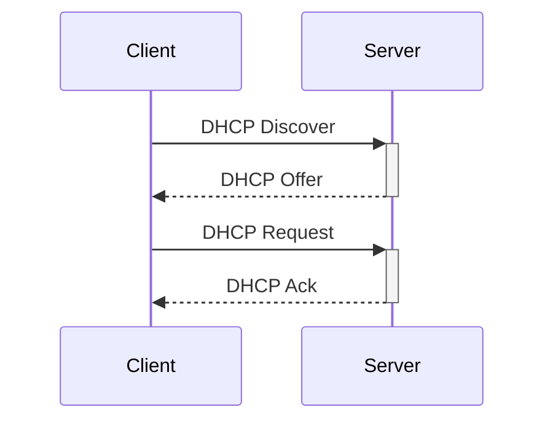

# DHCP
## 定义
> DHCP 是 Dynamic Host Configuration Protocol 缩写，中文翻译是<font color=#FF0000>**动态主机配置协议**</font>，顾名思义，一种用来动态配置 ip 地址的协议，工作在应用层。设想一下，如果一个企业或者数据中心里几百上千台机器，都需要网络管理员手动去分配 ip，简直是惨不忍睹。

<br/> 
既然有动态配置，那么应该有静态配置，通过下面命令行，可以手动配置 ip 地址

```
# 使用 net-tools
sudo ifconfig eth1 10.0.0.1/24
sudo ifconfig eth1 up

# 使用 iproute2
sudo ip addr add 10.0.0.1/24 dev eth1
sudo ip link set up eth1
```

## 解析 DHCP 工作过程



<br/>
<br/>

### DHCP Discover
> 新机器第一次加入网络时，人生地不熟，只能靠吼：我是新来的，这是我的 MAC 地址，谁能给我分配一个 ip 地址  
> <br/>
> 发出去的包长这样

> * MAC 层：自己的 MAC 地址为源地址，ff:ff:ff:ff:ff:ff 为目标地址
> * IP 层：0.0.0.0 为源地址，255.255.255.255 为目标地址
> * 传输层：UDP 协议，源端口：68，目标端口：67
> * 应用层：DHCP 协议，我的 MAC 地址是这个，我还没有 ip

<br/>
<br/>

### DHCP Offer
> 网络中的 DHCP 服务器收到广播包后，看到 MAC 知道这是一个“新人”，需要租给他一个 IP 地址，这个过程叫 DHCP Offer，它会为客户保留此 IP，不会把它再租给其他人  
> <br/>
> 发出去的包长这样

> ***客户端使用的协议栈会影响 offer 发出来的是广播包还是单播包，这里图贴的是广播包***，除了 ip 地址，还有子网掩码、默认网关信息

<br/>
<br/>

### DHCP Request
> 客户端的“吼”得到了回复，他很开心，如果有多个 DHCP Server，他还会收到多个 DHCP Offer，一般来说，他会选最先收到的 DHCP Offer 作为自己的 IP，这时他需要再广播一下他最终的选择，没有被选中的服务端需要撤销为他保留的 IP，留给其他新来的人用  
> <br/>
> 发出去的包长这样
  
> 此时还没得到服务端的最终确认，所以发出去的包还是用 0.0.0.0 作为源地址

<br/>
<br/>

### DHCP Ack
> 最后服务端需要宣布租约有效，并返回租约信息 
> <br/>
> 发出去的包长这样

> ***客户端使用的协议栈会影响 offer 发出来的是广播包还是单播包，这里图贴的是广播包***  
> 到这里，客户端终于在此局域网中有了立足之地了，可以和其他人愉快的交流了
> 实际上，客户端拿到 ip 后，还需要发送 ARP 请求来检查 ip 是否冲突

<br/>
<br/>

## 续租
> 既然是租用，就有到期的一天。和租房子一样，不能等到合约到期再续租，一般需要提前跟房东说。DHCP也一样，客户端会在租期过去 50% 的时候，向“房东”（租给他 ip 地址的 DHCP Server）发送 DHCP Request 消息包，房东再回复一个 DHCP Ack 包续约成功，如果拒绝续约，则发送 DHCP NAK 包；如果这时房东没有响应，则等到租期 87.5% 时直接广播 DHCP Request 包，后续处理和前面一样；如果到期了还没成功续租，则从新走一遍 Discover 流程

<br/>
<br/>

## 释放
> 主动和网络断开时，发送 DHCP Release 单播报文

## 重新加入
> 客户端重新加入已知网络时，直接拿上一次分配的 ip 等信息发送 DHCP Request 报文，服务器会尝试让客户端继续使用之前的 ip 并回复 DHCP Ack 报文；如果此 ip 无法分配，则回复 DHCP NAK 报文，客户端收到后需要发起 DHCP Discover 获取新的 IP
> ```
> # macos 用下面命令 release、renew
> sudo ipconfig set en0 BOOTP
> sudo ipconfig set en0 DHCP
> ```


## 问题
1. 什么情况服务器会拒绝续约
2. 哪些场景下会主动断开网络