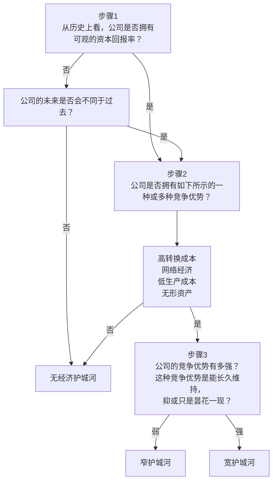

# 巴菲特的护城河

## 第二章：真假护城河

### 虚无的护城河

- 优质产品
- 巨大的市场份额
- 卓越的管理者
- 高效的经营效能

> 拥有这些品质不容易，确实能给企业带来优势，但不能保证在竞争的长河中这种优势能一直保持

### 真正的护城河

- 无形资产
- 客户转换成本
- 网络效应
- 成本优势

> 护城河是企业的内在结构性特征，某些行业/企业天生就比其他行业/企业优越。如果某些行业拥有比其他行业更具结构性的吸引力，那么，就可以在它们身上多花点工夫，这样，我们发现经济护城河的概率就会大为增加。
>
> 这些来源/标准都要求可持续性

## 第三章：无形资产

> 品牌、专利、法定许可证这些都是无形资产

- 品牌具有知名度并不代表在品牌上具有护城河。检验品牌具有护城河是看产品是否仅因为品牌，就可以比市场同类产品定价更高，或者说品牌具有市场定价权，消费者愿意因为品牌支付更高的价格。
- 拥有专利就拥有了独家生产产品的权利，可以垄断市场。但专利会到期的一天，也会持续受到挑战。专利要成为可持续竞争优势，要求企业拥有不断创新的基因，不断拥有新的专利。
- 拥有法定许可的难度越大，其他竞争者越难进入行业，企业越具有优势，但还是要看企业是否具有自主的定价权，以及是否有高资本回报率。垃圾处理厂和炼油厂同样需要营业许可，但因为炼油管道可以低成本运输，炼油厂不具备地区优势，资本回报率不及前者

> 真正的护城河是：拥有定价权的品牌的企业，拥有多种多样的专利的创新企业，拥有难于获取的监管许可的企业

## 第四章：转换成本

> 客户选择竞争对手产品付出的成本 - 使用新产品获得的收益
>
> 转换成本有不同的形式：与客户业务深度结合、客户使用新产品付出的时间成本和面临的不确定性风险，财务成本和培训成本等
>
> 零售业的转换成本经常很低

## 第五章：网络效应

> 企业可以受益于这样的网络效应：随着用户人数的增加，提供的服务或产品的价值也在增加
>
> 如果一家公司想从网络效应中受益，就必须营造出一个封闭的网络

## 第六章：成本优势

> 竞争对手是否能轻易实现同样的成本，如果能，就不算是真正的成本优势
>
> 成本优势可能来源于4个方面
> - 低成本的流程优势
> - 更优越的地理位置
> - 与众不同的资源
> - 相对较大的市场规模

### 流程优势

> 竞争对手如果能复制或者发明更低成本的流程，这种优势会转瞬即逝

### 地理位置优势

> 这类企业的产品价值重量比值（价值➗重量）较低，运输成本高

### 资源优势

> 拥有优质矿产的采矿业，能获取到优质原材料的企业

### 规模优势

> 规模越大，单位成本越低
>
> 在配送、生产、利基市场（非常小但需求明确的市场）这三个层次都存在规模效应

## 第八章：被侵蚀的护城河

> 投资者需要时刻关注竞争势态
>
> 下面是导致竞争优势丢失的几个重要因素
>
> - 技术变革
> - 在没有护城河的领域寻求增长 / 盲目扩张

## 第九章：发现护城河

> 每个行业都有自己的特征，我们更容易在像软件、媒体、金融服务等这些行业中找到具有护城河的企业。虽然在一些行业中，比如工业，很难找到具有护城河的企业，但也不能一概而论。
> 
> 评价企业盈利
> - ROA (Return On Assets) 资产回报率 = 净利润 / 总资产
> - ROE (Return On Equity) 股东权益收益率 = 净利润 / 股东权益
> - ROIC (Return On Invested Capital) 投入资本收益率 = 税后经营利润 / 投入资本（经营资产 - 无息负债）

## 第十章：管理没有想象中重要

> 企业所处行业、企业的结构性竞争优势比卓越的管理更能带来长期的成功

## 第十一章：分析公司是否拥有护城河

## 第十二章：估算企业价值

> 对具有护城河的企业不能盲目买入，还需要判断价格贵不贵
>
> 估算工具：价格乘数、收益、内在价值
>
> 影响股价涨跌的因素：
> 1. 反映企业财务的**投资收益**（每股收益）和股利
> 2. 反映其他投资者对股价预期的**投机收益**（PE）
>
> 影响企业估价的重要因素：
> 1. 企业在未来所能创造的现金（增长率）
> 2. 实现这些预测现金流的可能性（风险）
> 3. 企业运作需要的投资额（资本回报率）
> 4. 企业置竞争对手于门外的时间（经济护城河）

## 第十三章：估价工具

### 价格乘数

| 指标 | 优点 | 缺点 | 最适用场景 |
|---|---|---|---|
| PS（市销率） | 收入稳定、不易操纵；适用于亏损公司；不受一次性损益影响 | 完全忽略利润；不同利润率公司不可比 | 成长型公司（SaaS、互联网）；困境反转（收入稳定但利润暂时下降） |
| PE（市盈率） | 直观易理解；与投资回报直接相关；应用最广 | 利润易被操纵；周期行业失真；亏损公司无法使用 | 稳定盈利公司（消费、医药、成熟互联网）；护城河公司 |
| PB（市净率） | 反映安全边际；不依赖利润；适合资产驱动行业 | 忽略盈利能力；轻资产公司失效；账面价值可能失真 | 金融行业（银行、保险）；重资产行业（地产、钢铁、资源） |
| P/CF（市现率） | 最接近真实赚钱能力；不易操纵；能识别利润质量 | 受营运资金影响大；波动较大；计算较复杂 | 现金流稳定行业（公用事业、消费龙头）；识别低质量利润公司 |

### 收益率

> 收益率 = 1 / 市盈率，表示用这个价格买入股票，回报率是多少。这里的回报率是一个理论的回报率，实际的回报率取决于ROIC
>
> 现金回报率 = （自由现金流 + 净利息费用）/ （市值 + 有息负债 - 现金）
> 分子为收益，包括股东和债权人。分母为投入，买下整个公司的成本。本质是并购回报率

### 第十四章：该出手时就出手

> 如果以下问题（始终围绕着企业价值）至少有一个答案是“否”，那么就不要出手
> - 我是否犯了错误？
> - 企业经营是否出现了恶化？
> - 我的钱是否有更好的去处？
> - 这种股票在我的投资组合中占比是否过高？